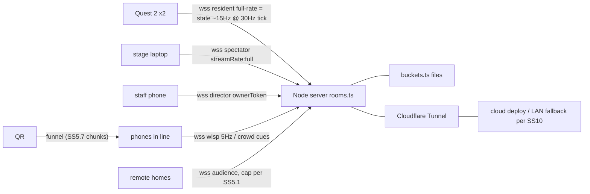
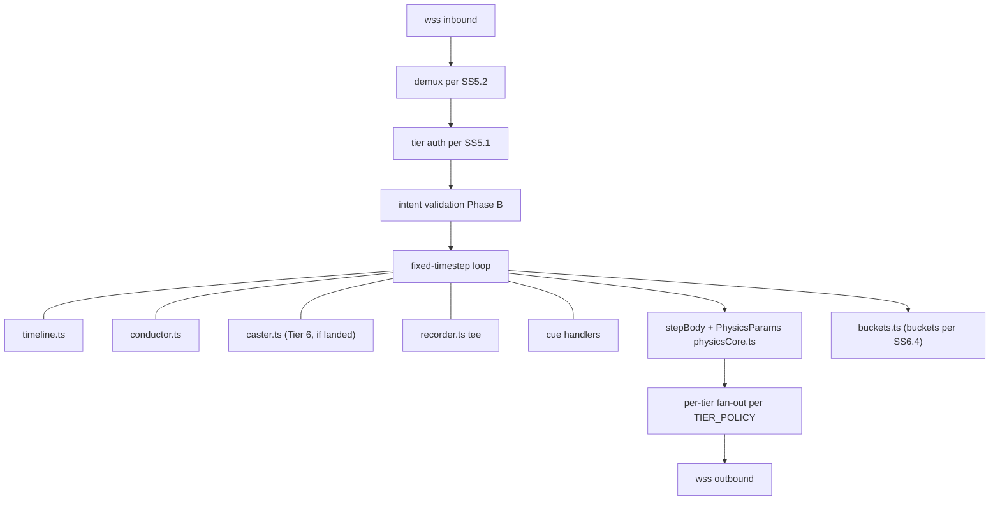
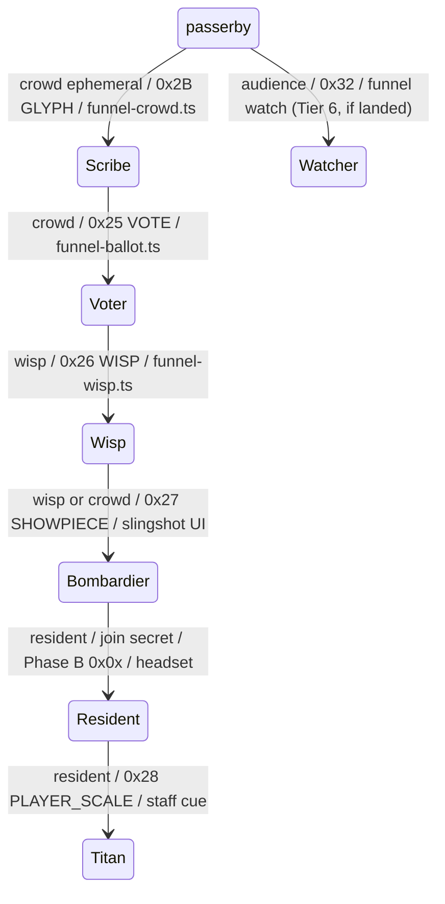
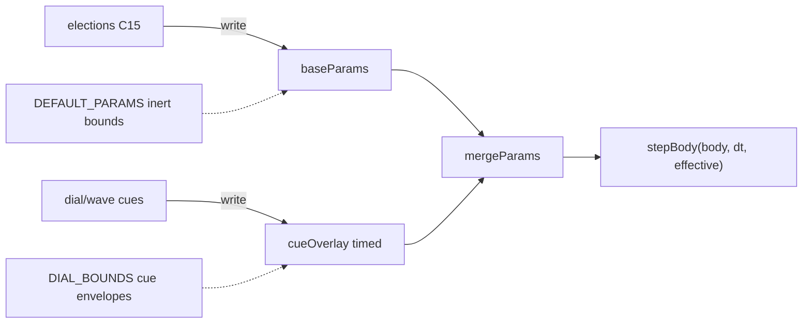

# Cyber Shapes VR — Phase C: "The Neon Broadcast" (Design Spec, v2.1)

**Date:** 2026-07-01 (v2 upgrade revision, same day; v2.1 Workshop revision 2026-07-02)
**Status:** Approved (design), pending implementation
**Owner:** Atvriders
**Prerequisite:** Phase A + Phase B landed (see `docs/superpowers/specs/2026-07-01-cyber-shapes-vr-upgrade-multiplayer-design.md`)
**Provenance:** see Appendix C. Short form: v1 = 32 concepts → 13 features, each verified by 2 adversarial skeptics + a completeness critic; the finished v1 docs then survived a 4-reviewer pass (59 findings, all fixed). v2 = a second 41-proposal upgrade round → 16 accepted items, each re-verified by 2 skeptics; every mandatory fix is folded into this text. Every requirement marked *(verified)* incorporates a skeptic's mandatory fix. **The moment:** openers are typographically non-normative — they never carry a *(verified)* tag and never introduce a number absent from the cited requirement.

## 1. Goal

At a VR booth, twenty people watch while two wear headsets — so Phase C makes the whole booth the product. The big screen runs a self-directing broadcast with procedural commentary and instant replays (phrased as "re-simulated, not recorded" only after C21's micro-resim parity test passes — §14). Anyone in line scans a QR and is inside the world in ten seconds (§5.7, C14) — leaving a permanent neon glyph, voting on the laws of physics, flying as a wisp, or bombarding the headset players with meteors. Every impact lands on-beat in a generative synthwave score, rotations end with a crowd-charged supernova that flashes every phone in the room in the same instant (§5.3, C19), and when the booth goes quiet, ghosts of the day's best players keep playing under a "SCAN TO ENTER THE VOID" sign. Remote viewers watch the live broadcast from anywhere — rendered from the data stream by their own GPU, not streamed as video (§7.14). Tier-5 and Tier-6 promises are subject to the §8 cut ladder.

Phase C serves three audiences at once — the crowd 5 meters away, the phones in the line, and CS students/faculty from other colleges — during walk-up 2–5 minute rotations, idle hours, and a full demo day.

## 2. Locked decisions

| Decision | Choice |
|---|---|
| Booth hardware baseline | 1–2 Quest 2 headsets + big screen (TV preferred over projector) driven by a laptop + powered speaker; everything degrades gracefully if pieces are missing |
| Phones | **Full participants** — QR scan joins the live room (tiered connections, §5.1) |
| Branding | Generic cyberpunk. No university theming layer |
| Session format | Walk-up rotations with an automated show cycle + staff-triggerable showpieces + attract mode |
| Narrative structure | Three nested frames (§4): Ladder of Presence (per-visitor) / The Broadcast (per-rotation) / The World That Remembers (per-day) |
| Rails (inherited) | One `wss://` port, opcode-multiplexed; no WebRTC/STUN/TURN; server-authoritative; TypeScript monorepo; Vitest; in-browser clients + one Node server; GHCR + Cloudflare Tunnel |
| New protocol space | `0x20–0x3F` opcode space (game `0x0x`, voice `0x1x` are Phase B's) — single registry, §5.2 |
| Connection model | One **tier enum** replaces all per-feature ad-hoc roles (§5.1) |
| Names on screens | **Never free text.** Server-assigned cyberpunk callsigns everywhere (§6.1) |
| Audio | One global priority ladder; room voice NEVER on booth speakers (§6.2) |
| Tier 6 ("The Impossible Broadcast") | Stretch features above every cut line, governed by the §8 Flex rules — staff-gated, never auto-cued, cut first, zero new Phase B asks |
| Commit policy | One commit at the very end of Phase C, after full verification (owner rule) |
| Repos/packages | Public |

## 3. Relationship to Phase A/B

- Phase C **consumes** the Phase A/B contracts: `ShapeStore` events, `stepBody`, fixed-timestep authoritative loop, delta broadcast + interpolation, late-join snapshot, avatar poses, opcode-multiplexed WS, file persistence.
- Phase C makes **four shared-core changes** (everything else is additive):
  1. `stepBody(body, dt)` → `stepBody(body, dt, params)` with `PhysicsParams` (§5.6) — parity-tested so default params ≡ Phase B behavior.
  2. Room manager gains **connection tiers** (§5.1) — the Phase B "≤8, >8 rejected" invariant becomes "≤8 **residents**, >8 non-privileged rejected"; the integration test is amended, not deleted. This change also carries the §6.4 store-level eviction invariant (recycle-oldest skips grabbed + pinned bodies — implemented with the tier work in plan C5, exercised by C10/C16).
  3. Delta/pose broadcast gains **per-tier fan-out policies** (rate decimation, subsetting) and a `u32 serverTick` header field (needed by replay; useful for debugging).
  4. The server overwrites Phase B's free-text presence `name` field with the assigned callsign at join (residents included) — existing nameplate/roster renderers display callsigns with zero client changes (§6.1).
- Four Phase B contract clarifications should land **before Phase B's protocol freezes** (coordinate with the implementing context):
  - Unknown-opcode-ignore semantics (clients silently skip opcodes they don't know) — makes every Phase C opcode additive. Unknown **kind bytes** within a known family are likewise ignored.
  - Grab-arbitration **rejections** may be broadcast (not just unicast) — feeds the Director's DUEL detector; optional, degrade by disabling that rule. Phase C's 0x2D broadcast is emitted **alongside** — never instead of — Phase B's existing unicast rejection; no Phase B message shape changes.
  - The `u32 serverTick` delta header (change 3 above).
  - `impactSpeed` included in the physics-step delta broadcast (consumed by Resonora §7.8 and Chrono Snap §7.11). A fifth additive field — release events carry server-computed `{pos, vel}` — is requested by §7.19 through the same mechanism (C0 Step 2 style; a field on an existing discrete event, not an opcode).
- **Hard invariant *(verified)*:** Tier 6 (§7.14–§7.21) adds **ZERO** new Phase B accommodation requests. The four-item list above is frozen; any Tier 6 need that cannot be met additively above the existing contracts is auto-cut.

## 4. Narrative structure (the three nested frames)

1. **Ladder of Presence (per-visitor):** passer-by → **Scribe** (Guestbook glyph, ~10 s, zero permissions) → **Voter** (Referendum ballot) → **Wisp** (named presence in-world) → **Bombardier** (Meteor Siege) → **Resident** (headset) → **Titan** (earned finale crown). Every promotion is a big-screen ceremony ("VOLT-17 ASCENDED TO WISP"). The queue-bridge is designed, not accidental: the rotation's top phone contributor is offered the next headset slot (staff-confirmable, §7.2). Appendix A/D3 draws this ladder with each rung's implementing tier + opcode.
2. **The Broadcast (per-rotation):** Showrunner's automated cycle: `ATTRACT → LOBBY → PLAY (≈3 min) → OVERLOAD (30 s) → FINALE → STATS → RESET → ATTRACT`. Everything else registers **cues** into this timeline.
3. **The World That Remembers (per-day):** The world resets every rotation — what visitors leave never does: glyphs outlive every RESET (§6.4 guestbook bucket), and the room permalink follows you home (§5.7 exit screen; §10 LAN-day export preserves it). Ghost Arcade banks the day's best takes, the leaderboard persists "fastest throw of the day", and the day ends with a scripted **Closing Ceremony** (final Encore + camera tour of every glyph + room permalink posted to the club Discord).

Frame 1 is the funnel, Frame 2 is the pacing engine, Frame 3 is the retention/recruitment engine. **Frame 2's cue abstraction is the implementation spine** (§5.5).

## 5. Target architecture — the Chassis

Everything in §5 is **Tier 0**: built once, first, and consumed by every feature.

### 5.1 Connection tiers

One enum, negotiated in the WS `HELLO`/join payload, enforced server-side per room:

| Tier | Cap/room | Auth | Receives | Sends | Voice |
|---|---|---|---|---|---|
| `resident` | 8 (Phase B invariant) | **join secret required** | full-rate deltas (cadence bound in plan C0) + poses + snapshot | intents + poses + voice + votes (§7.22 — the reducer keys on an opaque voterKey: device token on phone ballots, peerId on residents) | yes |
| `spectator` | 2 | **join secret required** | everything a resident receives **+ optional `streamRate: full`** (every physics tick, for replay fidelity) + roster (rttMs footnote below) + `CASTER_LINE` (when landed) | send-whitelist ONLY: heartbeat, clock ping, `0x2C` family (`REEL_*`, `REQUEST_SNAPSHOT`), stream-subscription control — all other intents dropped server-side | receives frames; decode-only, **playback OFF by default** (§6.2) |
| `director` | 2 | ownerToken | state + roster + `PHASE_STATE` + `CUE_CATALOG` | `DIRECTOR_CMD` | no |
| `wisp` | 24 | none (public QR) | decimated 5 Hz coalesced deltas + head-only poses (serialized **once** per room per tick, same buffer to all wisps) + `CASTER_LINE` (when landed) | wisp poses (5 Hz) + rate-limited intents (`WISP_PULSE` 2/s token bucket, `MET_LAUNCH` 1/3 s, votes, taps) | no |
| `crowd` | 64 | none (public QR) | `CROWD_CUE` + coalesced 2–5 Hz summaries (tally, charge, showpiece state) + `CASTER_LINE` (when landed) — never full deltas, poses, or snapshots | votes, charge taps (≤5/s debounced), glyph submissions | no |
| `audience` | 128 (≤ 4 per IP) | none (permalink-public) | **the audience union (THE single normative enumeration — §7.14, plan C25, and FAQ 6 cite this cell):** crowd's receive set ∪ wisp 5 Hz coalesced buffer ∪ head-only poses ∪ cached late-join snapshot ∪ `GLYPH` family ∪ `PHASE_STATE` ∪ `ENV_STATE` ∪ `THEME_SET` ∪ `SHOWPIECE` family ∪ `STATS_CARD` ∪ `MUSIC_CLOCK` ∪ `MUSIC_NOTE` (garnish) ∪ `AUDIENCE_STATE` (+ `CASTER_LINE` attach-if-landed) | heartbeat + `CLOCK_PING` only | no — **Tier 6, lands with C25; absent until then** (§7.14) |

- **Tier auth (the QR is public — assume hostile devtools at a CS booth):** `resident` and `spectator` joins require a per-room **join secret** derived from the ownerToken (§5.4), embedded only in the headset/stage bookmark URLs and the printed owner link — never in the public funnel QR. An unauthed privileged `TIER_HELLO` is downgraded to `crowd`, not rejected. Any connection presenting the ownerToken may send `DIRECTOR_CMD` regardless of tier (so the stage laptop's spectator connection carries staff hotkeys); a **resident**-tier connection presenting the ownerToken is additionally granted the `BUILD` capability (§7.23).
- **Guest scribes** (Guestbook) are ephemeral `crowd` connections: connect → `GLYPH_ADD` → ack → disconnect.
- **Voice:** the `VOICE_ROSTER` is the **senders** list = residents only. Voice **frames** fan out to authed `resident` + authed `spectator` connections only *(verified — Quest 2 cannot decode 20+ Opus streams; phone open mics beside speakers = feedback loop; unauthed connections must never receive room audio)*.
- Idle policy: `wisp`/`crowd`/`audience` connections with no intent/pose/heartbeat for 90–120 s are demoted/disconnected (one-tap rejoin); abandoned phone tabs never exhaust caps *(verified)*. Backgrounded viewer tabs explicitly stop their heartbeat on `visibilitychange: hidden` (Chrome timer clamping keeps hidden-tab timers alive past the idle window otherwise — §7.14).
- Over-cap behavior for booth participants is **never a rejection screen**: over-cap wisps land on a spectate page with queue position; over-cap crowd degrades to cheer-button mode. (Remote `audience` viewers past cap get a softer static "at capacity — the world reopens tonight" card — the doctrine is a booth-participant rule.)
- Phase B's `>8 rejected` integration test is amended to per-tier caps, with explicit tests for each tier's cap, downgrade path, and fan-out policy. `TIER_POLICY` gains an additive optional per-family receive field when the `audience` tier lands (C25) — existing broadcast call sites must not need editing (that is the acceptance criterion proving composition).
- Spectator row footnote *(verified)*: roster entries gain an additive `rttMs?: number` per resident (client-measured `lastRttMs` piggybacked on `CLOCK_PING`, server-stored, quantized 5–10 ms, refreshed ≤1 Hz on material change; rebroadcast to director + spectator tiers only). Server-side `ws.ping()` is **forbidden** for RTT — Cloudflare Tunnel originates its own protocol pings, so it measures server↔edge, not server↔headset.

### 5.2 Opcode registry (single source of truth: `packages/shared/src/protocol/opcodes.ts`)

`0x00–0x0F` game (Phase B) · `0x10–0x1F` voice (Phase B) · **`0x20–0x3F` Phase C**, assigned here once. Per-family sub-message `kind` enums are minted in the same file (later tasks ADD kinds there, never locally) with per-family uniqueness tests.

| Opcode | Message | Feature |
|---|---|---|
| 0x20 | `TIER_HELLO` / tier negotiation + callsign assignment (reply carries `roomEpoch`, Appendix B) | chassis |
| 0x21 | `PHASE_STATE` {phase, endsAt, remainingMs} (1 Hz heartbeat + on change) | Showrunner |
| 0x22 | `DIRECTOR` family: `CMD` / `CATALOG` / `ACK` kinds (+ `STAGE_XRAY`, `SAVE_CLIP` kinds when C29/C31 land) | Showrunner |
| 0x23 | `ENV_STATE` {serverTimestamp, mode, params, endsAt} | Reality Dials |
| 0x24 | `THEME_SET` {themeId, transitionAtServerTime} | Reality Channels (theme elections are ordinary §7.5 elections enacted as THEME_SET) |
| 0x25 | `VOTE_OPEN` / `VOTE_CAST` / `VOTE_TALLY` (2 Hz coalesced) / `VOTE_RESULT` | Referendum |
| 0x26 | `WISP_JOIN/LEAVE/POSE/PULSE/ROSTER` | Wisp Protocol |
| 0x27 | `SHOWPIECE_START/STATE/END` + `MET_LAUNCH` + `MET_HIT` (+ `WAVE` kind when C27 lands; `SHOWPIECE_STATE` gains {waveIndex, waveEndsAt}) | Meteor Siege |
| 0x28 | `PLAYER_SCALE` {peerId, scale, durationMs} | Titan |
| 0x29 | `MUSIC_CLOCK` (~1 Hz) / `MUSIC_NOTE` (binary, ~12–16 B) | Resonora |
| 0x2A | `CROWD_CUE` (~16 B) / `CHARGE_TICK/STATE` | Encore |
| 0x2B | `GLYPH_ADD/ACK/REMOVE/HIDE` | Guestbook |
| 0x2C | `REEL_*` (reel fetch/stream) + `REQUEST_SNAPSHOT` (attract→live resync) | Ghost Arcade |
| 0x2D | `GRAB_REJECTED` broadcast (additive; emitted alongside — never instead of — Phase B's unicast rejection) | Director |
| 0x2E | `STATS_CARD` / day-leaderboard | Showrunner |
| 0x2F | `METRICS_PING` (anonymous counters, §11) | chassis |
| 0x30 | `CLOCK_PING` (+ additive `lastRttMs` field, §5.1 footnote) | chassis |
| 0x31 | `CLOCK_PONG` | chassis |
| 0x32 | `AUDIENCE_STATE` {viewerCount} (0.2 Hz) | Gallery — **Tier 6, lands with C25** |
| 0x33 | `CASTER_LINE` {templateId: u16, slots: (callsign-index \| fixed-point number)[]} — never raw strings on the wire | MC NULL — **Tier 6, lands with C26** |
| 0x34 | `TELEKINESIS` family: `TK_PULL` / `TK_RELEASE` / `TK_HANDS_STATE` kinds | Powers Lab — **Tier 6, lands with C32** |
| 0x35 | `BUILD` family: `SET_TRANSFORM` / `SPAWN_EXACT` / `DELETE` / `LAYOUT_SAVE` / `LAYOUT_LOAD` / `LAYOUT_LIST` / `SET_BASELINE` / `GLYPH_SEED` (JSON payloads — Appendix B scope rule) | Workshop — **lands with C34** |
| 0x36–0x3F | **reserved-free** — no sibling may mint outside this table; Phase D mints from here when planned (Appendix D) | — |

Collision policy: no feature may mint opcodes or kind bytes outside this file; the table is a typed const with exhaustiveness + per-family kind-uniqueness tests. Byte layouts for hot binary families live in Appendix B. Single-kind families use kind `0x00`. Tier 6 and group W rows (0x32–0x35) are minted in C1 (registry stability; the BUILD kind enum lands with C34) but carry no traffic until their tasks land; codecs for cut features are retained dead code, not cleaned up mid-program.

### 5.3 Clock sync (`packages/shared/src/clock.ts`)

Phase B interpolation does **not** provide a server-clock offset *(verified — receive-time snapshot buffering only)*. Phase C builds one NTP-lite module, used by every synchronized moment:

- Min-RTT-filtered ping/pong offset estimation (EMA over samples, discard high-RTT), pure + Vitest-tested; target accuracy ±20 ms on booth Wi-Fi, ±40–80 ms on cellular.
- **Fire-at scheduling:** server stamps `fireAtServerTime`; leads are per-effect: 400–1000 ms for crowd-phone effects *(verified — 200 ms is too thin through the tunnel on LTE)*; one-to-two 16ths (125–300 ms adaptive) for Resonora notes.
- Late-arrival rules are per-effect and explicit: Encore detonation flash = **fire immediately if late** (reads as sparkle); slow ambient cues = tolerate 1–2 s; theme transition = snap with mini-glitch.
- Re-sync on `visibilitychange` **plus a slow periodic re-sample (~every 10 s) on resident/spectator clients** *(verified — headsets rarely background, so offsets and rttMs would otherwise be join-time-stale; also improves fire-at drift for Encore/Resonora)*.
- Timestamps on Phase C wire messages are u32 ms since a per-room **roomEpoch** (Appendix B).

### 5.4 Rooms, staff auth, security

- `CREATE_ROOM` (HTTP POST, same origin) returns `{roomId, ownerToken}` *(verified — net-new surface; Phase B has no creation endpoint)*. Token: sent only inside join payloads over wss (never in URLs), constant-time compared, hash persisted beside the room file (survives restart). Endpoint hardening: per-IP rate limit + global active-room cap + TTL eviction of never-joined/empty rooms. Failed-auth limiter keyed per (IP, roomId) with exponential backoff — never per connection.
- **Join secret:** derived as `HMAC(ownerToken, roomId + epoch)` with the epoch persisted beside the token hash *(verified — otherwise the secret cannot rotate)*. Gates `resident`/`spectator` tiers per §5.1.
- **Incident controls, scoped *(verified)*:**
  - `ROTATE_SECRET` — the primary one-tap control for a leaked staff bookmark / owner link: bumps the epoch, invalidates old staff URLs (they downgrade to `crowd`), re-issues staff bookmark URLs; roomId and every public permalink untouched.
  - `DOOR_CLOSE` — the leaked-public-QR remedy (with existing rate limits + moderation): pauses all NEW joins except authed resident/spectator.
  - `ROTATE_LINK` — retained as a confirm-twice **last resort** behind the Advanced tab (the secret gates nothing on the public wisp/crowd path); its confirm text names the permalink cost; the old id serves a static "this room has moved — check the club Discord for this world's new home" page that never discloses or forwards to the new roomId (the Closing Ceremony posts the final permalink to Discord, so recovery has a human-gated channel).
- Roster entries carry **join provenance** `{entryRoute, joinedAt}` (rendered by C10) and the additive `rttMs` field (§5.1 footnote).
- Server-side mute = drop that senderId's `0x1x` frames at fan-out; "kick" = disconnect (honest UI copy owned by C10).

### 5.5 Cue engine + RoomTimeline (`packages/shared/src/cues.ts`, server-side)

- **Cue** = the one abstraction every feature plugs into: `{id, label, tab: 'show'|'advanced', destructive?, cooldownMs, phases: Phase[], comfortCost, run(room: RoomHandle)}`. Server advertises available cues via `CUE_CATALOG`; consoles render whatever is advertised *(verified — no hard dependency between Showrunner and any sibling feature)*. `CUE_CATALOG` re-broadcasts to director tier on registry change (capability-gated cues, §7.21).
- **RoomHandle** (the parameter every cue handler receives; exact members reconciled in plan C0): `{store, setBaseParams, setCueOverlay, broadcast(opcode, payload, tiers?), timeline, roster(), humanResidents(), pin(shapeId), unpin(shapeId)}`.
- **RoomTimeline**: pure state machine with a complete transition table — ATTRACT is indefinite and exits via `advance()` on first **human** resident join *(verified — synthetic peers never advance the timeline, §7.17)*; timed phases auto-advance on expiry: `PHASE_DURATIONS_MS = {LOBBY: 45_000, PLAY: 180_000, OVERLOAD: 30_000, FINALE: 90_000, STATS: 30_000, RESET: 10_000}` (exported shared constant — RUN_OF_SHOW.md cites it by name); `advance()` = manual/event override; `hold(ms)` extends; an active showpiece/encore — or the Workshop's build-mode cue (§7.23) — holds phase advance until its END event, toggle-off, or a hard cap; build-mode additionally suspends the auto-cue playlist while active.
- Server broadcasts `PHASE_STATE {phase, endsAt, remainingMs}` at 1 Hz + on change (clients extrapolate from remainingMs — drift-proof without clock-offset dependence).
- **Auto-cue playlist:** PLAY = one ambient cue ≈ every 90 s from the **pacing table** (cooldowns + per-rotation `comfortBudget`; aggressive cues blocked during PLAY's first 60 s); **ATTRACT = continuous ambient cueing at a shorter interval, comfort-free cues only** *(verified — the idle-hours content engine; must tolerate a small catalog without stalling)*. Staff triggering is an override, not the only path. **Tier 6 cues never enter the pacing table** (§8 Flex rules).
- Cue commands carry client-generated `cueInstanceId`s; server dedupes. `fire()` returns `'ok'|'cooldown'|'deduped'|'wrongPhase'|'unknown'` — consoles surface `wrongPhase`/`cooldown` as disabled states.
- **RESET handler** (server): despawn all world shapes, revert params (base AND overlay) to `DEFAULT_PARAMS`, respawn the curated **showroom baseline** (authored seed list in shared constants), `metrics.count('rotation')`; world persistence never captures mid-showpiece forces.

### 5.6 PhysicsParams (`packages/shared/src/physicsCore.ts` — the one shared-core change)

```
PhysicsParams {
  gravity: Vec3            // clamped |g| ≤ 8
  wind: Vec3
  timescale: number        // ∈ [0.1, 2]; freeze is NOT timescale 0
  freeze: boolean          // short-circuits stepBody before any float ops (bit-exact conservation);
                           //   clients also pause autonomous rotation/bob while frozen (a frozen world is fully
                           //   static — §7.3/§7.23; the client render-pause is implemented in C11 so TIME-FREEZE
                           //   has it even when the Workshop is cut)
  attractors: {pos, strength, minRadius}[]   // strength-capped, min-radius-softened
  bounds: { ceilingY?: number, softSphereR: number, speedCap: number }
  suspendDespawn: boolean  // dials set true; REMOVE_DISTANCE despawn skipped while set
  restitution?, friction?, restThreshold?    // scaled with |g| so bounce modes terminate
}
```

- **Defaults are inert:** `DEFAULT_PARAMS.bounds = { softSphereR: Infinity, speedCap: Infinity }`, `suspendDespawn: false` — Phase B's fly-free-and-despawn-at-50 behavior is preserved bit-for-bit. The active containment values live in an exported `DIAL_BOUNDS = { softSphereR: 18, speedCap: 30 }` constant that dial/showpiece cues apply in their param envelopes.
- Parity test: default params ≡ Phase B constants, bit-for-bit — including bodies beyond r=18 and faster than 30 m/s, and bodies that reach r>50 and must still report `removed: true` under defaults.
- **Params composition (two layers):** elections write `baseParams` (a standing law, persists until the next election or staff REVERT); dial cues write a timed `cueOverlay`; `effectiveParams = mergeParams(baseParams, cueOverlay)` and a cue's auto-revert pops the overlay back to `baseParams` — never directly to `DEFAULT_PARAMS` (a bullet-time cue must not silently repeal an elected low-gravity law). **Single-overlay-writer guard:** while a showpiece wave overlay — or the Workshop's build-mode freeze (§7.23) — is active, cues that write `cueOverlay` are refused via the existing `wrongPhase`/cooldown path *(verified — §7.16, §7.23)*.
- **Containment is part of the params, not a hope** *(verified — flipped gravity + `REMOVE_DISTANCE=50` despawns the whole world in ~5 s)*: gravity flip mirrors the floor as a ceiling rest plane (shapes pile overhead, rain down on revert — the better show); wind/supernova/attractor ejections bounce off the `DIAL_BOUNDS` soft sphere; `suspendDespawn` is set while a dial is active; per-body speed cap from the same envelope.
- Params affect **shapes only** — never the player rig, camera, grid, or voice timing (vestibular anchor + comfort).

### 5.7 Phone entry funnel (code-split, join-first)

The QR resolves to **one funnel page** that is its own tiny bundle and negotiates tier by intent:

- **Ballot/crowd/scribe entry:** plain DOM, no Three.js, `< 100 KB`, scan-to-first-interaction < 5 s on congested LTE *(verified — this number IS the recruitment hook)*.
- **Wisp entry:** join-first, render-later — **callsign picker (choose from ~6 server-offered curated-wordlist options — never a free-text field, §6.1)** + color picker + WS join complete before any 3D loads (`< 300 KB` gz initial); the wisp exists in-world at handshake; phone shows "YOU ARE IN — look at the big screen"; magic-window 3D lazy-loads after *(verified)*.
- **Watch option:** the funnel offers WATCH; the exit-screen permalink carries `?watch` so remote arrivals default to `audience` during live occupancy and to the entry funnel when idle (or offers both — the after-hours souvenir survives) *(verified — Gallery is additive, never a regression of the "visit from your dorm" promise; Tier 6, with C25)*.
- Post-participation exit screen (**the funnel bottom**, critic-mandated): your callsign, "your glyph is at ring N", club Discord/mailing-list QR, and the persistent room permalink ("this world stays online — your glyph is part of it") — **with "the world goes online tonight — same link" copy variant when the server reports LAN mode** (C23 wires detection).
- Screen Wake Lock on join; brightness prompt for Encore (§7.12).

### 5.8 Package layout

```
packages/
  shared/      + protocol/opcodes.ts, tiers.ts, callsigns.ts, clock.ts, cues.ts, physics params,
                 wisps.ts, titanMath.ts, tkMath.ts, replay.ts, reels.ts, stageBrain.ts, casterGrammar.ts,
                 siegeWaves.ts, daemons.ts, elections.ts, glyphs.ts, themes.ts, music/ (beatClock, quantizer, noteMap)
  server/      + tiered room manager + tier auth, RoomTimeline, buckets, Conductor, caster host,
                 ReelRecorder, cue handlers (dials/siege/titan/encore), daemons.ts, clips endpoint, metrics
  client/      + entry modes: ?mode=stage | ?mode=director | funnel (ballot/crowd/wisp/watch) as separate
                 Vite entry chunks; stage/{overlays,mixer,replay,attract,xray,clips}; music/{themeSynth,synth}
```

## 6. Global policies (apply to every feature; test-enforced where possible)

### 6.1 Identity & moderation
- **Callsigns everywhere:** server-assigned cyberpunk handles ("VOLT-17"); optional pick-from-curated-wordlist (client `requestedName` is a validated wordlist index, ignored if invalid); free-text names never reach any screen *(verified — projector-slur defense; also fixes join friction)*. Callsigns are **unique per room+day** (checked against active roster ∪ day-stats ∪ guestbook attributions, retry with fresh number, 3-digit fallback) *(verified — ~200 joins over 3,600 combos yields near-certain collisions otherwise, and the leaderboard, glyph ownership, and queue bridge all key on them)*. The `DMN-` prefix is reserved for synthetic peers (§7.17). The wordlist is pronounceable by construction (a TTS review criterion, §7.15).
- Attribution redundancy beyond color (colorblind + 24-wisps-7-colors reality): callsign + per-entity trail/pattern styling accompany color on every attribution surface.
- Staff **panic key** (console + stage hotkey) hides the newest N glyphs AND all name surfaces instantly — including live caster captions, with `speechSynthesis.cancel()` (§7.15). The panic behavior extends to the `audience` tier's 128 anonymous home screens *(verified)*.
- Ghost Arcade reels are sanitized **at record time** (identity opcodes stripped/anonymized; voice opcodes excluded — both test-enforced) while **preserving the synthetic presence flag** so a banked daemon replays with its DAEMON badge (§7.17). Print a small "anonymized gameplay may be recorded and published as short clips" sign (kit list — copy covers both reels and §7.20 clips).

### 6.2 Audio priority ladder (one mixer policy, owned by the stage client)
1. Showrunner klaxon/stingers (duck everything)
2. Encore riser/drop
3. Resonora quantized mix (or standalone theme music) — TTS captions duck-shim at this level with fast release (§7.15)
4. Ghost Arcade attract loop
5. Ambient SFX
- **Room voice is NEVER played on booth speakers** (co-located mics + speakers = feedback). Voice stays headset-to-headset for remote participants only; SPEAKER-cam director rule applies to remote participants only.
- Booth PC + powered speaker is the single authoritative full mix; Quest strap speakers get a reduced self+nearby mix (no shared earbuds — hygiene); phones are muted by default (visual feedback instead).
- Stage Chrome launches with `--autoplay-policy=no-user-gesture-required` (runbook item) *(verified — attract mode has no user gesture; also covers speechSynthesis activation gating)*.
- Scope: this ladder governs the STAGE client. Headset-local audio (klaxon cue, Quest note voices, impact SFX) is separate and never routes through the stage mixer.

### 6.3 Comfort & photosensitivity
- Physics/theme effects never move the camera, rig, horizon, or grid transform (grid = vestibular anchor; "grid shockwave" is an emissive pulse, zero displacement).
- Flashes ≤ 3 Hz, single-pulse for Encore, staff disable switch; headset glitch transitions ≤ 500 ms (desktop may run 1 s).
- Aggressive dials (gravity flip, purge) are gated out of a fresh wearer's first minute via the pacing table; staff one-tap REVERT/VETO.

### 6.4 World hygiene & persistence buckets
- Persistence buckets: **world** (shapes — reset per rotation to a curated "showroom" baseline on `RESET`), **guestbook** (glyphs — never wiped by rotation resets), **day-stats** (leaderboard, metrics — wiped at day close after the Closing Ceremony export), and — when the Workshop lands (C34) — **layouts** (named compositions incl. the showroom baseline; never wiped; §7.23).
- Showpiece forces are never persisted mid-flight; `RESET` restores the baseline world.
- **Store-level eviction invariant:** `MAX_SHAPES` recycle-oldest and every eviction path skip bodies with `grabbedBy !== null` and system-**pinned** bodies (Encore orb, siege crystal, TK-pulled shapes) — a meteor storm must never despawn the shape in a defender's hand *(verified)*. Owned by plan C5 (implemented in the store/rooms module alongside `pin()`/`unpin()`; C10 and C16 exercise it).

### 6.5 Performance budget ledger (the "thousand near-zeros" defense)
- One shared document + test: worst-case simultaneous load = 40 shapes + 8 avatars + 24 wisp instances + glyph impostors + 12 Resonora voices + 2 voice decodes + theme transition + Encore blast, on Quest 2, ≥ 72 fps.
- Hard sub-budgets *(all verified)*: wisp tier ≤ 4 draw calls total (one InstancedMesh billboard + one nameplate atlas, zero lights); in-headset glyphs = nearest ~32–48 as one merged fat-line batch + Points impostors for the rest (< 5 k points, 1 draw call); Quest sky = baked cubemap (≤ 4 Hz re-bake) or ≤ 2-octave noise, uber-shader with `themeId` branch or `compileAsync` prewarm (acceptance: first in-headset theme switch produces no frame > 20 ms); Resonora ≤ 12 pre-allocated equal-power-panned voices on Quest (HRTF reserved for voice); meteors/showpiece shapes get zero dynamic lights.
- **Tier 6 ledger lines** (each recorded in `BUDGET_LEDGER.md` before its feature's cue is advertised): audience-tier server egress at cap (~8–10 KB/s × 128 ≈ 10 Mbps, cloud deploy); hand-joint polling + neon skeleton hand rendering (2 instanced joint meshes, zero lights) with the §7.21 measurement condition.
- **Concurrency clause *(verified)*:** Tier 6 showpieces are mutually exclusive with Tier ≤5 showpieces via the existing cue cooldown/phase machinery; any overlap requires re-baselining the worst-case load definition and the soak.
- Stage laptop budget: internal render capped at 1080p + upscale, half-res bloom, dynamic resolution governor, PiP inset ≤ 480p — validated on an integrated-GPU laptop.
- Server: one 30-minute **soak test** in the headless harness — full room + full crowd + siege (waves active when landed) + recorder + conductor + stage fan-out (+ audience at cap with a stalled-socket and a reconnect-stampede case, when landed) concurrently, assert no tick overrun.

### 6.6 Degrade-not-break ladder (every feature declares its rungs)
Global rungs: no internet (LAN mode, §10) → no big screen (headset + phones still work) → no headsets (crowd + screen show) → no crowd (server bots/barrage + auto-cues) → nothing (attract ballet). A feature that cannot state its rung for a missing dependency doesn't ship. Sibling wiring is always an **attach-if-landed hook**; the standalone fallback is the shipping target.

## 7. Feature specifications

Each feature below is the merged concept **plus every mandatory skeptic modification**. Build costs are post-verification (honest) sizes. §7.1–§7.13 are Tiers 1–5 (v1, verified); §7.14–§7.21 are **Tier 6** (v2, verified) and obey the §8 Flex rules; §7.22–§7.23 are **the Workshop group** (v2.1, verified by its own 3-reviewer round — Appendix C).

### 7.1 F1 — Neon Director (stage client + auto-director) [M]
**The moment:** a player hurls a torus knot and the big screen hard-cuts to a tracking shot chasing it through the neon void in full bloom, then cuts to the thrower's lower-third — the screen directs itself like an esports broadcast (§7.1, C9).
- Stage = `spectator`-tier client on the booth laptop (its connection carries the ownerToken for staff hotkeys); desktop-quality render (existing bloom chain).
- **Shot brain** (`stageBrain.ts`, pure, Vitest with synthetic event streams): v1 ships exactly 3 conservative hard-cut rules — FOLLOW_THROW (release-velocity spike; damped velocity-lookahead), WIDE_ESTABLISH (dead-air default: slow orbit + music-reactive visuals + enlarged join-QR CTA — never close-ups of hesitant players), JOIN_CRANE (crane-down on join ceremonies). Min-shot-length + hysteresis invariants under test. DUEL/SPEAKER/PiP are v2 stretch (DUEL via two hands within grab radius of one shape day-1 heuristic; `GRAB_REJECTED` opcode when available; SPEAKER only for remote participants).
- `stage.requestShot(shot, holdMs)` — external cue→camera hook (GLYPH_BIRTH, crystal cam, worm's-eye, POWERS framing all ride it).
- Overlay package (DOM/CSS over canvas): neon lower-thirds (callsign + color + pattern redundancy), event ticker (ambient texture, never load-bearing), docked static-geometry QR (glow may pulse; code never scales/warps), "N PLAYERS — 1 WORLD — 1 SOCKET" ticker (§14). Explicit **overlay slot priority**: replay chrome > cue banner > caster caption > ambient ticker *(verified)*.
- 5-meter legibility rule for all overlays; PiP (v2) rendered post-composer at ≤ 480p, heavily damped, labeled "HEADSET CAM", cut to as a beat rather than always-on.
- **Staff hotkeys 1–9/0 force specific shots/targets**, overriding the brain until released or a timeout; brain resumes with invariants intact *(verified — the auto-director-taste mitigation)*. Kiosk resilience: WS auto-reconnect, auto-reload on renderer stall, periodic health-check of the PUBLIC join URL — swaps QR for an "ask staff" card when the tunnel is dead.
- Degrades: no headsets → films shapes/phone action with the avatar-less ruleset; nobody → hands off to Ghost Arcade.

### 7.2 F2 — Showrunner (director console + rotation timeline) [S/M]
**The moment:** a staffer taps one button and the entire mixed-reality room — headsets, projector, every phone — snaps to the same beat (§5.5, C10).
- Server-side RoomTimeline (§5.5) + `PHASE_STATE`; console is a DOM-only `?mode=director` page.
- **Dual control surface:** big-screen laptop keyboard hotkeys (Space=advance, F=finale, H=hold+60 s, R=reset) are primary; staff phone is a convenience (Wake Lock, auto-reconnect, fully stateless — re-renders from `PHASE_STATE` + roster + cooldown snapshot).
- **Two-tier UI:** SHOW tab = three giant buttons + roster; everything else behind Advanced. Destructive cues confirm; nothing else does. Roster rows show tier + join provenance and expose per-peer mute (server-side voice-frame drop) and kick labeled "disconnect" (Advanced tab). Panic key lives on both surfaces.
- **Console payoff with zero siblings = phase control + roster + stats card + two seed cues (shape-rain, low-g); the compound cue bank arrives with C11, which the cut ladder guarantees** *(verified — the v2 cue-bank collapse, plan C10/C11)*.
- STATS phase broadcasts `STATS_CARD` (shapes thrown, fastest throw, top contributor callsign + "NEXT IN THE HEADSET?" queue-bridge line); day-leaderboard persisted via the day-stats bucket.
- In-headset countdown = environmental red pulse + klaxon (client cue handlers); numeric countdown only on stage.

### 7.3 F3 — Reality Dials (PhysicsParams cue bank) [S/M]
**The moment:** forty shapes freeze mid-air; the player walks among them, rearranges two, and the room snaps back into motion at once (§5.6 freeze conservation, C11).
- Ships as **compound cues**, not raw parameters *(verified — a kinetic pre-roll guarantees motion: FREEZE = impulse burst → 1.5 s chaos → freeze; BULLET TIME auto-launches 2–3 server shapes if ambient kinetic energy is low)*; raw params stay the tested core.
- Cue bank (built once, in C11, on the two C10 seeds *(verified)*): GRAVITY FLIP (ceiling pile → rain on revert, short auto-revert), LOW-G, BULLET TIME (×0.25), TIME FREEZE (5–8 s cap + countdown), NEON STORM (wind + spawn bursts, held shapes exempt from eviction), SINGULARITY (attractor accretion disk), SUPERNOVA drop script (pull–hold–detonate). All envelopes carry `DIAL_BOUNDS` + `suspendDespawn: true`. **SUPERNOVA is "the built-in finale cue"** everywhere that phrase appears (RUN_OF_SHOW, plan C24): its `phases` INCLUDE FINALE and it carries the showpiece-active guard instead (refused only while a siege/encore overlay is live); the ambient overlay-writing dials exclude OVERLOAD/FINALE per §7.16.
- Big-screen **cue banner** is a hard deliverable ("BULLET TIME ×0.25" + progress bar, driven by `ENV_STATE`) — separates "showpiece" from "looks broken".
- `ENV_STATE` carries `serverTimestamp` (sting scheduled against the interpolated timeline) + `endsAt` (late-join coherent auto-revert).
- Palette LUT scopes to shapes + environment only; avatar identity colors exempt.

### 7.4 F4 — Wisp Protocol (phones as in-world participants) [M+]
**The moment:** ten seconds after scanning, the headset player waves at YOU — "the pink one just joined!" — while the big screen banners your callsign (§5.7 join-first funnel, C14).
- The `wisp` tier (§5.1): named/colored neon presence on a server-assigned orbit slot; slots biased into the headset player's view frustum and toward the stage camera; join fires a **fanfare** (light beam + chime + headset toast + big-screen banner) *(verified — the system produces the greeting)*.
- Aim: **touch-drag with auto-aim cone is the default**; gyro is progressive enhancement (camera-relative ray only — deviceorientation is relative since Chrome 50; double-tap recenter; motion mode gated on receiving an actual event within ~1 s of permission grant, so in-app QR browsers fall back silently) *(verified)*.
- `WISP_PULSE`: server-clamped radial impulse; feedback is unclamped — wisp-colored tracer + 300 ms shape flash in the wisp's color + ring shockwave *(verified — attribution is the hook)*.
- Quest budget: single InstancedMesh + nameplate atlas, ≤ 4 draw calls, structural render test.
- Join funnel per §5.7; honest bandwidth: ~55–70 kbps/phone worst case, ~2 Mbps at 30 phones *(verified)*; slot recycling per §5.1 idle policy.

### 7.5 F5 — Reality Referendum (crowd elections) [S+]
**The moment:** the tally bar tips at zero, a klaxon fires, every shape in the world floats ceiling-ward, the headset wearer yelps — and fifteen people in line cheer because THEY did that (§7.5 legibility floor, C15).
- Election reducer (open → tally → enact → cooldown), pure + tested; enactments write `baseParams` (standing laws — dial cues fired later revert back to the law *(verified)*); options reference dial cue ids (theme options are registered by C20 when it lands). Theme elections are ordinary elections enacted as `THEME_SET` — there is no second vote path *(verified — §5.2 row 0x24)*.
- Ballot page per §5.7 (DOM-only). Ballots ride `crowd` tier; crowd-at-cap harness test.
- **Adaptive cadence + never-dead ballot** *(verified)*: 45–90 s under traffic; between elections the ballot shows laws-in-effect (from `baseParams`) + a tap-to-charge-next-election meter (something to press within 2 s of scanning).
- **Enactment legibility floor** *(verified)*: server auto-tops-up to ~20–30 shapes before enacting; first visible change ≤ 300 ms after zero, then the staggered cascade; stage cuts to a stable wide camera for the money shot.
- Big screen owns the drama: dueling tally bars, countdown takeover, "THE CROWD DECREED" splash.
- Option curation by phase (no purge during a fresh wearer's first minute); staff REVERT/VETO restores the previous `baseParams` *(verified — tested)*; localStorage device token anti-stuff (documented as best-effort).

### 7.6 F6 — Meteor Siege (90 s crowd-vs-headset showpiece) [M/L]
**The moment:** someone in line throws a meteor from any phone in line; the player catches it out of the air and hurls it back — server-side rewind makes a 100 ms-late grab land (§7.6, C16).
- Phones (wisp/crowd tiers) slingshot meteors (drag = aim+power; one `MET_LAUNCH`/3 s, recharge ring); server spawns via the authoritative store (per-launcher colors, MAX_SHAPES recycle-oldest server-side honoring the §6.4 eviction invariant, meteors never get lights); crystal center-world (server-**pinned**) with HP scaled by participant count.
- **Arming semantics:** auto-armed in OVERLOAD extends the phase via `hold(60_000)`; the full 90 s version is FINALE/staff-armed. Self-terminating.
- **Lag-compensated catches** *(verified — the marquee moment breaks at 50–150 ms RTT otherwise)*: ~300 ms server-side position-history ring per meteor; grab intents carry client timestamps, validate against rewound position with generous radius (~0.5 m); client predicts attach, rolls back on reject; meteor speed capped 6–8 m/s on arcing trajectories.
- **Swat = client-claimed `MET_HIT` intent** (hand velocity + timestamp), server plausibility-checked against the same rewind buffer; cut swat entirely if over budget — catch-and-throwback carries the moment.
- Defender skill floor: aggressive catch-assist during showpieces (enlarged radius, brief approach slow-window); flailing first-timers still generate named deflect flashes. Staffing note: one club "ringer" in headset 1, walk-up guest in headset 2.
- Built-in auto-framed crystal camera + oversized HP bar + rate-limited callout queue (1 per 2 s; catches > throwbacks > swats > hits) ships **inside** this feature (F1 upgrades it, never gates it) *(verified)*. During a siege, this callout queue owns catch/swat/hit narration; the caster (when landed) contributes only arm and end-card lines (§7.15).
- Auto-arm at ≥ N phones or idle timer; staff override. No-uplink rung: server-spawned barrage keeps the spectacle alive crowd-less.
- End card: "CRYSTAL STANDS"/"CROWD WINS" + top-3 bombardier callsigns → feeds stats card + queue bridge. Wave escalation is §7.16 (Tier 6).

### 7.7 F7 — Titan Protocol (the photo moment) [S/M]
**The moment:** a player grows tenfold; the neon world becomes a city at their feet, and on every phone screen a giant's hand sweeps down scattering shapes — the shot people post (§7.7, C17).
- **Rig scale, not world scale** *(verified)*: player rig group (camera + both controllers/grips) scales 1→5 default (10 behind a second button) over 1.5 s ease about the floor point; outgoing poses are world matrices so the netcode path is untouched; remote clients multiply avatar scale by presence `playerScale`; nameplate scale clamped; OrbitControls tolerance verified; fog behavior noted and styled.
- **Titan hands are impulse sources** *(verified — the sweep must be real)*: server applies radial impulses (from hand velocity) to non-grabbed shapes within the scaled hand radius each tick (pure math in `titanMath.ts`); optional titan-only two-shapes-per-hand palm grab.
- Server clamps: `TITAN_THROW_MAX` velocity, out-of-bounds recall (beyond `WORLD_RADIUS` → respawn at origin — **scoped to titan-active only**, checked in the server tick before the physics `removed` flag is honored; baseline throws keep Phase B despawn semantics *(verified)*), one-titan invariant, hard auto-revert (30 s) incl. revert-on-disconnect.
- The trigger cue also forces the stage into a hardcoded low-angle worm's-eye shot + "TITAN PROTOCOL" glitch banner on stage and phones *(verified — the camera ships with the feature)*.
- Phones get an active beat: shapes thrown at the titan vaporize on proximity with a burst *(verified — spectators become a firing squad)*.
- Ops: one-tap "Titanize current headset player" (server picks the XR-flagged peer). Pose smoothing + optional temporary pose-rate bump for the titan avatar (10× jitter amplification). Environment stays unscaled; grid swaps to a denser LOD during titan (moiré).
- Prerequisite: phones seeing the giant requires the wisp magic-window (F4); without it, phones get a cutaway card.

### 7.8 F8 — Resonora (the world is the instrument) [M]
**The moment:** a stranger's cube lands ON the beat as a bass note; they look up, throw another one on purpose — and the crowd realizes the synthwave track on the speakers is being written by the players (§7.8, C18).
- Server Conductor quantizes impact/spawn/grab/release events to a beat grid; note = pure function (pitch = colorIndex scale degree, timbre = shape type recipe, octave = size, velocity = impactSpeed, pan = position). `MUSIC_NOTE` binary events with `playAtServerTime` (Appendix B).
- **Adaptive lookahead + local prediction** *(verified — fixed 1-beat lookahead kills causality)*: grid time = next 16th ≥ (client p95 one-way delay + margin); local client schedules its OWN notes immediately at the next 16th (deterministic note id; dedupe on server echo); the existing instant impact SFX stays as the sub-50 ms causal transient under the tonal tail; backward-snap window (~60 ms) halves worst-case delay.
- **Big-screen causality visualization is a hard deliverable** *(verified — the crowd wow must survive sound-off)*: beat ring + per-note flash ON the shape at `playAtServerTime`, color-coded per player.
- Quest: ≤ 12 pre-allocated equal-power voices (HRTF is voice-only); spectator PC runs the heavy mix + ConvolverNode reverb.
- Generative backing layer seeded deterministically from (roomSeed, beatIndex, state histogram) — zero events, identical on all clients.
- Auto-intensity governor (density scales with activity; mellow attract groove when idle). Per-player note-rate budgets; drum/melody role split by shape type — pure tested functions.
- **Sound-design acceptance gate:** owner-approved reference mix recorded on real hardware (Quest strap speakers + booth speaker at hall volume).
- "Impacts" = floor bounces only (no shape-shape collision) — stated, and it bounds note density by design.
- Faculty line (accurate version): quantization hides network jitter AND interpolation delay — the note lands within a 16th of what the player sees.

### 7.9 F9 — Reality Channels (procedural realities) [M]
**The moment:** mid-throw, the whole universe glitches for half a second and snaps into a different reality — different sky, different palette, different musical key — on every device in the room simultaneously (§7.9, C20).
- `ThemeDef` pure-data table — **ship-gate 3 themes** (Cyber Grid, Ghost Monochrome, one hero: Vaporwave Sunset or Tron Canyon; +2 stretch), each: fog/grid uniforms (custom shader grid replaces GridHelper — counted work), skydome shader branch, palettes, bloom tint, music block (drives the standalone **theme synth** — `music/themeSynth.ts`, first built for F10's attract loop: 2-osc drone + logical-BPM beat clock; scale/BPM/timbre retune per theme); `THEME_SET {themeId, transitionAtServerTime}` (1 byte state, persisted, snapshot); bar-boundary alignment only if F8 lands.
- Theme changes by staff cue or by **ordinary §7.5 election** (options registered into the C15 pool when C20 lands) — never a separate vote path.
- Quest path per §6.5 (baked cubemap sky, uber-shader/prewarm, no full-screen post, flat-gradient auto-fallback; acceptance: first in-headset switch has no frame > 20 ms). Vertex jitter via CPU transforms; comfort per §6.3. "Bit-crush" = stepped quantization-curve swaps crossfaded via wet/dry gain (WaveShaper curves aren't automatable).
- Late `THEME_SET` on congested phones → snap with mini-glitch. Avatar identity colors exempt from palette LUT.
- Stage/attract line: "N REALITIES · 0 ASSETS · 100% PROCEDURAL" (§14). **5-meter test** acceptance: adjacent themes differ in sky content, hue family, and one silhouette feature.

### 7.10 F10 — Ghost Arcade (attract mode = replay of real humans) [M]
**The moment:** from across the hall the screen shows people playing; up close you realize they're translucent ghosts — real recordings, not video — and the QR is inviting YOU to replace them (§7.10, C13).
- Server `ReelRecorder` tees the outbound broadcast: **coalescing recorder** (last-write-wins for continuous fields; lossless union for discrete events) + snapshot keyframes at segment start and every ~10 s (reuse the late-join serializer); frames stamped with tick/wall time; loop via crossfade at keyframe boundaries *(verified — naive downsampling drops events and diverges)*.
- Record-time sanitization per §6.1; honest budget ~5–7 KB/s at full room (~25 MB/h) with rolling caps.
- **Content plan inverted** *(verified)*: 3–5 rehearsed "hero takes" recorded by club members pre-event are the default bank; day-of capture is an auto-banker (ring-buffer last session, score windows by events/s + shape count + player count, bank best window on room-empty; daemon-heavy windows down-ranked, never blanket-excluded — the synthetic flag is preserved and replays with the DAEMON badge, §7.17); staff hotkey optional; curation end-of-day.
- Idle detection is activity-based (no **human** intents/poses for N s — never connection count; synthetic activity is invisible to it, §7.17) *(verified)*; attract state machine pure + tested; `REQUEST_SNAPSHOT` resync on attract→live.
- Ghost rendering: same interpolation + avatar renderer at 70 % opacity, GHOST_XX nameplates; dissolve on first meaningful **human** activity; choreography driven by the theme synth's logical beat clock (AnalyserNode is garnish); reels served over the WS (`REEL_*`) from the Node container's volume.
- The 5 m hook is motion + giant QR + typography; ghost authenticity is the close-range/faculty layer (one-line staff narration script ships in the runbook). Venue-brightness mode (high-exposure palette toggle); "bring a TV" in the kit list.
- Standalone rung: runs as a windowed client mode with a slow-orbit camera if F1 is cut. Day-one rung: scripted shape-ballet before any reels exist.

### 7.11 F11 — Chrono Snap (jumbotron instant replay) [S given F10, M standalone]
**The moment:** the screen VHS-scrubs backward and replays the catch at quarter speed with the camera orbiting the impact — the stadium-jumbotron shot everyone is trained to cheer at (§7.11, C21).
- Stage-side ~30 s ring buffer (deltas/poses + self-snapshotted keyframes ~1 s); the pure ring-buffer/replay-player lands in `packages/shared/src/replay.ts` with a thin stage adapter *(verified — v2: enables §7.19 without a later extraction refactor)*. Requires the `u32 serverTick` header + `impactSpeed` broadcast.
- **Slow-mo fidelity** *(verified — 15–20 Hz lerped at 0.25× is mush)*: preferred = spectator `streamRate: full` subscription (§5.1) — one connection at the server tick rate (exact Hz bound in plan C0) ≈ 60–120 KB/s, frame-accurate; plus micro-resim of free-flight segments via shared `physicsCore` between keyframes (this also makes the "re-simulated, not recorded" flex line TRUE — the line is forbidden until this passes, §14); minimum = synthetic contact keyframes at impact ticks. Segments under active non-default dials fall back to lerp and suppress the resim flex line.
- **Highlight vocabulary grounded in real physics** *(verified — no stacks/pileups/shape-shape collisions exist)*: top-decile-velocity floor slams, mass shape-rain bursts, long-arc throws, grab duels (only once `GRAB_REJECTED` exists); replay camera framed wide enough that shape pass-through is not focal.
- Primary hotkey = "replay last scored highlight" (min-activity threshold — staff can never air 6 s of idle bobbing); raw last-10 s/30 s secondary. Orbit camera + oversized "REPLAY // T-4.2 s" chrome are must-ship acceptance criteria (else "just use OBS").
- Replay entities namespaced from live; live PiP inset bloom-free at reduced res; interpolation layer accepts injected clock + message source (socket or buffer) — a Phase C requirement on the shared interpolation module.

### 7.12 F12 — Supernova Encore (the engineered applause moment) [M]
**The moment:** the crowd charges a supernova with their phones; the player hurls the orb; on impact every shape blasts outward, the drop hits the speakers, and every phone in the room strobes white in the same instant. Staff says one line: "you all just wrote that" (§5.3 fire-at sync, C19).
- **Ambient light rig:** `CROWD_CUE` (~16 B; slow latency-tolerant pulses from live events; per-phone seed phase offsets ripple the crowd).
- **Finale:** CHARGE_START → phones show TAP-to-charge (primary; shake via DeviceMotion is opt-in garnish behind the iOS gesture; ≤ 5/s debounce; server-normalized by crowd size) → max-brightness prompt at join and CHARGE_START *(verified)* → rising meter everywhere + riser on speakers (phones silent/vibrate) → at 100 % the **pinned** orb spawns beside the headset player (normal Shape; auto-launch if unthrown 10 s) → first impact fires the drop timeline at `fireAtServerTime` (500 ms–1 s lead): radial impulse (standalone pure `applyRadialImpulse` with Vitest goldens) + **deterministic seeded arp as primary drop audio** + synchronized single white flash (≤ 3 Hz cap, staff disable, late phones fire immediately). The F9 `THEME_SET` hard-cut and the F8 Resonora 16-bar melody replay are BOTH attach-if-landed hooks (`themeCut?`, `melodySource?`) *(verified — cut from critical path; F9 builds AFTER F12 in the task order)*; the no-sibling fallback climax visual is a room-wide palette flash via `CROWD_CUE` + `ENV_STATE`. Encore core never depends on a sibling.
- **Low-participation robustness** *(verified — phones-as-pixels collides with phones-as-cameras)*: big screen mirrors the constellation (joined count + pixel mirror) so the moment reads even with phones down/filming; effect tuned to look complete at 5 phones; staff script includes "phones up!".
- Rotation fit: whole arm→charge→drop ≤ 90 s (the FINALE window); console cooldown so it stays special. Degrade rungs: no headset → auto-detonate; no crowd → staff detonate; no projector → phones are the display.

### 7.13 F13 — Neon Guestbook (persistent crowd-made constellation) [M]
**The moment:** you draw a squiggle on your phone while waiting in line, and seconds later it crystallizes as a kaleidoscope mandala floating in the void — with your callsign, forever; at day's end you come back and find it hanging among three hundred others (§7.13, C12).
- Phone canvas (live 6-fold kaleidoscope preview while drawing) → stroke resampled ≤ 32 points + color → ephemeral guest connection submits `GLYPH_ADD` → server validates (bounds, count), assigns id + deterministic expanding-spiral-shell slot outside the play volume, persists to the guestbook bucket, broadcasts.
- **The birth moment is the product** *(verified)*: during attract, the camera flies to the new glyph within ~5 s (beam-in crystallize + callsign lower-third + spawn chord, via `stage.requestShot`); during rotations, HUD toast + 3 s stage highlight. Phone gets "You are VOLT-17 — find your glyph" + placement confirmation (closes the loop even with no projector).
- Rate limiting: localStorage token (politeness) + **server-wide glyph-inflow token bucket** (bounds troll throughput and render cost regardless of identity games; overflow queued with feedback) + per-phone lifetime cap (~3); NEVER per-IP (CGNAT) *(verified)*. Moderation: kaleidoscope = beauty + partial obfuscation only; real mechanism = staff one-tap despawn + optional approval-queue mode for strict events + panic key; callsigns per §6.1.
- Rendering per §6.5 (Quest: nearest 32–48 merged fat-line batch + Points impostors — which IS the "constellation"; full fidelity + projector-legible fat lines + core+halo stroke on stage). Backfill chunked (~32 glyphs/frame) post-snapshot. Budget ~512 glyphs, evict-oldest.
- Pre-seed ~50 authored glyphs (hour-one never empty). Names only on stage when the camera focuses a glyph.

---

### 7.14 F14 — The Gallery (remote audience tier) [M/M+] — **Tier 6, C25**
**The moment:** a parent, a rival club, a friend in a dorm — anyone with the link — watches the live booth broadcast from anywhere, rendered by their own GPU from an ~8–10 KB/s data stream, picking their own camera. The stage counter reads "N WATCHING · 0 VIDEO FRAMES SENT" (§14 gate; C25 soak-at-cap).
- New `audience` tier per §5.1 (cap 128, permalink-public, receive-only). **The receive set is the §5.1 audience-row union — that table cell is the single normative enumeration; this section, plan C25, and FAQ 6 all cite it** *(verified — closes the panic-key hole and renders glyph births, elections, phases, dial banners, themes, stats, and the music clock)*. Strictly less than spectator; §6.1 panic-key tests extend to this tier.
- **Per-source limits (the unauthed-surface defense)** *(verified — adversary pass)*: ≤ 4 concurrent audience connections per IP + a per-IP join-attempt token bucket that also throttles cached-keyframe sends (the stampede guard protects CPU; this protects egress). Harness test: one IP opening 64 sockets → capped + throttled, others unaffected. (The §7.13 never-per-IP doctrine is written for booth phones behind CGNAT; remote viewers are the case it doesn't cover — note the mobile-CGNAT caveat in the runbook.)
- **Permalink routing during live occupancy** *(verified — remote actors must not consume booth caps or the queue bridge)*: the `?watch` permalink routes to `audience` ONLY while the room is live-occupied; wisp/crowd entry is reachable only via the booth-QR variant of the funnel URL (a distinct path the Discord post never carries). Full entry returns on the permalink when idle. C25 test: the permalink page during occupancy exposes no wisp/crowd join. Runbook note: staff verbally confirm queue-bridge offers.
- `metrics.gauge('peakWatchers', n)` sampled from the audience roster (feeds §11).
- Viewer page = desktop render path minus input + camera-mode switcher: **core = free-orbit + follow-a-player + viewer counter + pause/rejoin** *(verified — the local StageBrain auto-director mode is a stretch sub-item; the "StageBrain runs anywhere" line is forbidden until its event-adapter parity test passes, §14)*. Phones following `?watch` route to the lite magic-window renderer (bundle-budget-tested). During ATTRACT the viewer reuses attract ghost playback — the after-hours permalink shows ghosts, not an empty room.
- **Fan-out honesty:** reuses C2's serialize-once wisp buffer (zero marginal serialization); audience late-join is served from the recorder's most recent ~10 s keyframe + roll-forward (a Discord-link burst of 128 joins costs zero fresh snapshot serializations) *(verified — snapshot-stampede guard, same-buffer spy test)*; `permessage-deflate` stays disabled on the fan-out path (C0-style binding line).
- **Backpressure (mandatory)** *(verified)*: per-socket `bufferedAmount` threshold — skip sends past ~64–128 KB buffered, disconnect to "paused — click to rejoin" past a hard ceiling; harness test: one stalled audience socket at cap → tick never overruns, others unaffected.
- **Hidden-tab handling** *(verified — Chrome timer clamping defeats the idle window)*: the viewer explicitly stops heartbeat / closes the socket on `visibilitychange: hidden`; §5.1 idle policy is the backstop only.
- Audience never counts as occupancy: ATTRACT-exit stays human-resident-triggered; idle detection ignores audience (they send no intents/poses — asserted).
- Over-cap: static "at capacity — the world reopens tonight" card *(verified — no third streaming mode for viewer #129)*. LAN-day rung: the cloud permalink page detects booth-offline server-side (zero residents for N min → "goes online tonight" copy or attract ghosts).
- **Seeding the gallery is an announcement problem** *(verified)*: runbook gains a doors-open step — post the watch link to club Discord + department channel at day START; exit screen gains "it's live right now — share it"; the stage counter renders only at N ≥ 5.
- Runbook notes: Cloudflare WS supported on all plans (unquantified fair-use volume — hence the cap + degrade + documented paid-zone/direct-origin fallback) and the ~100 s free-plan idle-WS timeout (continuous deltas keep viewers alive; "paused" reconnects rather than idles).

### 7.15 F15 — MC NULL (procedural caster + camera heat) [M] — **Tier 6, C26**
**The moment:** "VOLT-17 WITH THE INTERCEPT — THAT'S THREE STRAIGHT!" glitches across the screen as the camera cuts to the catch; the followed player is suddenly famous, and the commentary is a pure function under golden-transcript tests (§7.15, C26).
- **Host split *(verified — both skeptics)*:** `casterGrammar.ts` is pure in `packages/shared`; the stateful host is `packages/server/src/caster.ts` (Conductor pattern) fed by the server's own event stream + day-stats reads — the server emits `CASTER_LINE` (0x33) to spectator/wisp/crowd (+ audience if landed); the stage RENDERS captions from 0x33 and never generates lines (the spectator send-whitelist is not extended).
- **Wire encoding:** `{templateId: u16, slots: (callsign | fixed-point number)[]}` where a callsign slot is **self-contained**: (curated-wordlist index u16, numeric suffix u8) reconstructing "VOLT-17" client-side from the shared C1 wordlist — no tier needs a roster to render captions *(verified — crowd/audience receive 0x33 but no roster)*; rendered to text client-side from the shared grammar — free text cannot enter by construction; ~30 B honest. In the C26 golden round-trip.
- `casterLine(event, ctx, rng): CasterLine | null` — significance gate reuses the C21 highlight scorer **factored into shared with a reduced signal set — extract/reuse, never reimplement** *(verified — shared-thresholds test so caster and replay agree on what counts)*; `ctx` carries the **phase hype ladder** (a line-intensity tier keyed off `PHASE_STATE` — LOBBY calm → PLAY normal → OVERLOAD/FINALE hype; it selects among template variants and never changes the quota); null is the default so SILENCE is baseline (no filler, ever — test-enforced: golden transcripts, silence-on-quiet-stream, no-repeat LRU ~3 min, per-rotation quota, **≥ 3 variants per event kind**, max 1 caption/10 s, hard per-line character budget + max 2 lines for 5-meter legibility). The fame extension lands in `stageBrain.ts` as an ordinary input-event consumer with the cfg key kept as `heatThreshold` (no rename churn in a Tier ≤5 module).
- **Rotation-scoped memory *(verified)*:** heat map, streak memory, LRU, and quota ALL clear on RESET; cross-rotation references only via the day-stats bucket ("FASTEST THROW TODAY" stays legal). Golden test: a two-rotation transcript never references a rotation-1 callsign after RESET unless it holds a day-stats record.
- **Fairness invariant *(verified)*:** heat (renamed `fame` — C9's cfg already uses `heatThreshold`) breaks ties among FOLLOW_THROW candidates only; no single resident gets more than ~60 % of FOLLOW_THROW shot time per rotation; runbook note halves the club ringer's fame. Rule-priority-unchanged + JOIN_CRANE/WIDE_ESTABLISH-never-starved invariant tests.
- **Label↔signal truth tests *(verified)*:** every numeric template slot declares its source signal — THROW lines bind release velocity, IMPACT lines bind impactSpeed; day-stats superlatives only fire when the record is actually beaten.
- **Single caption authority *(verified)*:** during an active showpiece, F6's callout queue owns catch/swat/hit narration; the caster contributes only `arm` and `endCard` kinds (golden test enforces it). Stage overlay slot priority per §7.1.
- **§6.1 compliance:** panic key clears the caption, suppresses the caster, and calls `speechSynthesis.cancel()`; a caster-mute cue sits in the Advanced tab.
- **TTS is garnish:** default OFF, staff toggle; `speechSynthesis` exposes no AudioNode — a duck-shim (utterance onstart/onend ducks priorities 3–5 with fast release; any priority-1 event cancels the utterance) *(verified)*; acceptance criteria never reference TTS.
- **Shipping target = stage-caption-only** *(verified — v1 doctrine)*: 0x33 fan-out to remote viewers/clips is attach-if-landed; content pipeline gate: club-written template variants are repo-reviewed authored copy; the golden-transcript file is the review artifact and an owner read-through is a C26 acceptance step (mirrors F8's sound gate). Cut-order note: MC NULL is cut second-to-last within Tier 6 — it amplifies every feature below it.

### 7.16 F16 — Siege Waves (escalating wave arc) [S/S+] — **Tier 6, C27**
**The moment:** "WAVE 3 — BULLET TIME" slams across the screen; the meteor cloud freezes to quarter speed mid-air and the defender Neo-catches three in a row while the crowd's slingshots keep firing (§7.16, C27).
- Shared `SIEGE_WAVES: WaveDef[]` = {name, durationMs, meteorRateMult, hpBonusMult, dialOverlay?: Partial<PhysicsParams>, comfortCost}. Waves advance on timer/HP thresholds inside the existing siege; each wave's overlay applies via `setCueOverlay` and pops back to `baseParams` between waves (an elected law survives the whole siege — tested).
- **Meteor in-flight budget (the math fix)** *(verified)*: spawns gated on `inFlightMeteors ≤ METEOR_BUDGET` (< MAX_SHAPES minus a showroom reserve, ~28). WAVE 3 CUTS spawn admission (rateMult ≈ **0.25–0.35** server-side — at timescale 0.25 flight time is ×4, so admission drops proportionally) — the frozen cloud is dense because meteors linger, not because more launch; a data-driven test over the table asserts `rate × mult × flightTime(timescale, gravity) ≤ budget` so rehearsal retuning can never silently reintroduce mid-air despawn pops (wave 1's admitted rate must leave the headroom the test forces). Client cooldown UI untouched (rateMult is server-side only — zero funnel diffs). The crowd keeps firing at ≥ 1× cooldown cadence during wave 3 so phones stay busy *(verified — launch cadence stays high; admission is what throttles)*. `SIEGE_WAVES` lives in its own shared module `packages/shared/src/siegeWaves.ts` — **the sibling module is the requirement, not an alternative** *(verified — "Tier 6 is cut" must leave no residue in Tier ≤5 files)*. Cross-constant tie *(verified — §7.23)*: `baselineCap + METEOR_BUDGET ≤ MAX_SHAPES` — the showroom reserve METEOR_BUDGET assumes is enforced at `SET_BASELINE`, so a composed baseline can never be eaten by a meteor volley.
- **Bullet-time window cap:** any wave overlay with timescale < 0.5 runs a bounded 10–15 s window inside the wave (tested invariant), consistent with the FREEZE-cap precedent; drama intent = defender last stand; HP thresholds rehearsal-tuned so "CROWD WINS" stays reachable.
- **Overlay contention:** dial cues' `phases` exclude OVERLOAD/FINALE (fire → `wrongPhase`), plus a showpiece-active guard for staff-forced fires; test: dial fired mid-wave rejected, wave overlay intact, law survives.
- **The marquee fires on the zero-volunteer path:** the OVERLOAD auto-armed siege runs the wave table once its `hold(60_000)` engages; staff FINALE arm is the override. Σ wave durations ≤ the 90 s window; HP-advance only shortens; wave logic never extends holds beyond C16's arming semantics.
- Wave state: physics rides ENV_STATE (mode = wave, endsAt = wave end — late-join coherence + cue banner for free); `SHOWPIECE_STATE` carries narrative only ({waveIndex, waveEndsAt} — banner strings resolve client-side from the shared table; no names on the wire). Announcements ride the cue-banner treatment (full-screen splash), never the callout queue *(verified)*. Unknown-kind-ignore asserted for the 0x27 family (banner-only degrade rung is test-backed).

### 7.17 F17 — Daemon Crew (server-side constructs) [M] — **Tier 6, C28**
**The moment:** a lone visitor during quiet hours throws a cube into the void — and a glowing drone construct catches it and lobs it back. The booth's most common bad demo (solo sandbox, hesitant camera) becomes a game of catch (§7.17, C28).
- Daemons are server-hosted **resident-tier** peers (they need grab rights) entering through the standard join path flagged `synthetic: true`; intents flow through normal validation — no god-mode. Callsigns from the reserved `DMN-` namespace (§6.1). v1 ships **fetch-and-return ONLY** (target = chest-height offset from the nearest human head pose — never the head; catchable 3–6 m/s arcing lobs; C16's catch-assist wired to daemon return throws *(verified — Tier 4 is guaranteed landed below Tier 6)*); orbit-juggle + siege-co-defender behind flags.
- **Synthetic-blind human-presence signals (the load-bearing fix, all test-enforced)** *(verified — both skeptics)*: `humanResidents()` on RoomHandle; C5's ATTRACT-exit = first HUMAN resident join; C13 idle detection ignores daemon intents/poses (a daemon-only room still enters attract); auto-banker's room-empty trigger likewise; C8 metrics exclude synthetic joins from `count('join')`/peakConcurrent (or a separate 'daemon' key — never in the club's day export).
- Dismissal completeness: auto-dismiss on RESET, when human residents ≥ 2, AND when the last human resident departs; eviction/dismissal releases any held shape via the standard disconnect path; counted inside the 8-resident cap and evicted FIRST when a real resident joins at cap (never block a human — tested).
- Exclusions, test-enforced: VOICE_ROSTER, C10 leaderboard/queue bridge ("DMN-03 NEXT IN THE HEADSET?" must be impossible), JOIN_CRANE ceremony (daemons get a distinct "DMN-07 ONLINE" glitch banner). Reels: sanitizer PRESERVES the synthetic flag; daemon-heavy windows down-ranked by the auto-banker, not blanket-excluded *(verified — quiet-hour sessions are the typical capture)*.
- Grab deference *(verified — fixes zero-RTT god-mode-in-effect)*: daemons never claim a shape within a defined radius/time window of a human hand or pending human claim, and release immediately if contested; test: a contested same-window grab always resolves to the human.
- **Ship gate:** staff/cue-summoned only at ship; the LOBBY auto-summon sits behind a config flag enabled after an owner acceptance pass of the recorded fetch-and-return script on the real stage (mirrors F8's gate) — a taste failure degrades to "feature off", never "bug on the big screen". Non-humanoid drone styling + DAEMON badge (protects the "every human-shaped ghost is a real player" narration; runbook gains the one-liner).
- Zero new opcodes (rides Phase B game opcodes + presence; `synthetic` is an additive presence flag like `playerScale`). The pose-synth/behavior chassis is a pure shared module consumed by C22's load generators *(verified — honest framing: shares the module; the Phase B harness already hosts multi-client)*. Faculty line (accurate): "those agents run server-side through the same validated intent path and grab arbitration as the humans."

### 7.18 F18 — X-Ray Broadcast (stage-only netcode overlay) [S/M] — **Tier 6, C29**
**The moment:** staff taps once and the broadcast splits into truth and presentation — raw tick-stamped server snapshots as fading dots beside the smooth world the players see, and a red ghost world running 300 ms behind labeled "+300 ms — WHAT LAG FEELS LIKE." Visiting CS faculty watch authority-vs-interpolation live, and nobody's play degrades (§7.18, C29).
- Staff stage-LOCAL hotkey is the primary trigger (zero protocol, works when the tunnel is sad); the director-console path is a `STAGE_XRAY` kind on the 0x22 family (minted in the registry). `phases: ['PLAY','ATTRACT']`; auto-revert on the 60–90 s timer AND any transition into OVERLOAD/FINALE; never in the pacing table. **Precedence in ATTRACT** *(verified — else the quiet-hours use case is dead)*: firing x-ray during ATTRACT PAUSES ghost/ballet playback for the x-ray window and attract resumes on revert; the auto-cancel rule applies to a C21 replay starting and to live-content transitions — never to the pre-existing ATTRACT state (asserted in C29's state-exclusion tests).
- Split-truth rendering: (1) raw layer — last N snapshot positions per shape as fading tick-stamped dots; (2) the normal interpolated render; (3) the +300 ms delayed ghost world — a second interpolator instance fed by C21's ring buffer read at −300 ms when C21 landed, else a standalone delay-FIFO shim (Vitest: delayed state at t ≡ live state at t−300 ms on a synthetic stream); (4) HUD strip: tick rate, snapshot age, interp buffer ms, per-resident RTT chips.
- **RTT mechanism *(verified — the pitched source didn't exist)*:** per §5.1 footnote — client `lastRttMs` piggybacked on CLOCK_PING (with the §5.3 10 s re-sample), server-stored, roster-carried to director+spectator only; chips labeled "client-reported". `ws.ping()` explicitly forbidden (Tunnel measures the wrong leg).
- Interp-buffer/snapshot-age stats are computed in `stage/xray.ts` at the shim/source layer — the verified C0 Step 3 interpolator signature stays frozen *(verified)*.
- **Broadcast chrome is a must-ship acceptance criterion** *(verified — else it reads as a debug overlay left on)*: oversized "NETWORK X-RAY // LIVE DIAGNOSTIC FEED" banner + the three claim banners ("SERVER TRUTH" / "WHAT PLAYERS SEE" / "+300 ms — WHAT LAG FEELS LIKE") at 5-meter scale; numeric chips are close-range (explicit §7.1 exemption: a narrated 60–90 s inspection mode); bloom fully dropped while active (presented as an intentional mode switch); ghost capped to shapes only; owner look-approval on the actual stage laptop before task close.
- **Shelf-ware defense *(verified)*:** C23 runbook gains the when-to-fire note (CS visitors at the table) + the narration line: "the dots are the raw truth from the server; the smooth world is what interpolation buys you; the red world is you on hotel Wi-Fi — all the same socket." Honest protocol delta: zero new opcodes; one additive CLOCK_PING field + one additive roster field + one kind byte.

### 7.19 F19 — Pocket DVR (every viewer's own jumbotron) [S–M] — **Tier 6, C30**
**The moment:** a skeptical CS senior watching from their dorm drags a timeline slider, rewinds the broadcast ten seconds, and orbits the frozen throw from their own angle — one hundred viewers can each do this independently, which video flatly cannot (§7.19, C30).
- The C21 ring buffer + keyframes + injected-source interpolator + micro-resim (already in `packages/shared/src/replay.ts` per §7.11) gain a scrub UI consumed by the stage and remote viewers. **Dependency gate:** hard on C21; the audience half is attach-if-landed on C25 (if C25 dies, C30 ships stage scrub + wisp-tier DVR; if C21 dies, C30 dies) *(verified)*.
- **Substrate verification (Step 0, C0-style)** *(verified — two coalescers exist)*: verify the decimated stream audiences/wisps actually receive preserves release events with server-computed {pos, vel} (the §3 fifth additive field), or rebase that fan-out onto `reels.ts` `coalesceFrame`; keystone test: a 5 Hz-decimated synthetic throw fixture contains the release event AND micro-resim endpoint-ε passes on that fixture. **All "rewind the broadcast" copy is forbidden until this passes** (§14); on failure, copy demotes to "scrub the broadcast" with plain interpolation.
- **Pose honesty:** wisp/audience poses are head-only at 5 Hz — copy scopes to shape trajectories ("rewind the shot," "re-frame the throw"); catch-centric copy requires hand poses in the audience subset (an explicit C25 negotiation item, ~+3 KB/s per viewer if taken).
- **Resume = drain-the-buffered-ring-forward ONLY for non-spectator tiers** (client keeps consuming + ring-buffering while paused; jump-to-live control; ring-cap eviction trims the scrub range from the back; §5.3 background-tab gaps shade the timeline; heartbeats continue while paused so idle-kick never fires mid-scrub). `REQUEST_SNAPSHOT` stays spectator/stage-only. Say "zero marginal fan-out cost," not "zero server cost" *(verified)*.
- **Yield-to-live rule (booth-critical)** *(verified)*: on SHOWPIECE_START, CHARGE_START, or VOTE_OPEN, a scrubbed viewer auto-snaps to live with a banner; plus ~10 s idle auto-return — the DVR must never cost anyone their participation beat.
- UI frozen as acceptance criteria: scrub + 0.25×/1× + orbit + a mandatory "REWOUND // T-6.2s" badge (a paused phone is never mistaken for a frozen room); default speed 1×; 0.25× auto-engages only inside resimmed ballistic segments. No in-headset DVR. Stage surface: the scrub bar is secondary/Advanced; C21's "replay last scored highlight" hotkey remains the one-volunteer path.
- Bundle hygiene: the DVR module lazy-loads with the wisp 3D chunk; memory: 60 s ring at wisp rates < ~1 MB (asserted); namespace-leak test extended (a scrubbed replay never leaks into the live inset or live scene).

### 7.20 F20 — Neon Clip Machine (highlight → shareable WebM) [M+] — **Tier 6, C31**
**The moment:** a visitor exits the headset, and during the stats card the screen shows "SCAN TO TAKE YOUR CLIP HOME" — fifteen seconds of THEIR catch, chyroned with THEIR callsign, rendered from the re-simulated replay minutes after it happened (§7.20, C31).
- **Compositor canvas (mandatory — correctness)** *(verified — both skeptics: DOM overlays are never captured by `captureStream`)*: a fixed 1280×720 2D compositor canvas draws each frame — `drawImage(stage WebGL canvas)` + canvas-drawn callsign chyron + caster line (attach-if-landed on C26) + replay chrome + QR end-slate (2–3 s — it must survive VP8 compression and scan off another phone's screen) — and `captureStream(30)` runs on the COMPOSITOR. Decouples clip resolution from stage 1080p; 9:16 vertical becomes a crop of the same pipeline (labeled stretch — never rotation airtime).
- **Codec ladder (pure, unit-testable probe order)** *(verified)*: `video/mp4` (Chrome 126+ platform/HW encoder — cheaper on iGPU AND iMessage/social-previewable) → `video/webm;codecs=vp8,opus` @720p → vp9 only if explicitly enabled after headroom is proven. Audio via the C9 mixer's master GainNode tapped through `createMediaStreamDestination` (confirm/add the master-bus tap — one line). Room voice is structurally absent because the mixer never contains it (§6.2).
- **Delivery loop (the wow's missing leg, now primary)** *(verified)*: clipId pre-minted before recording; the burned-in QR end-slate IS the retrieval URL (`GET /api/clips/:id` — clipId ≥ 128-bit random *(verified — unlisted must mean unguessable)*, per-IP GET rate limit + per-clip daily download cap, TTL to day close, day-close sweep); after save the stage shows the ~20 s "TAKE YOUR CLIP HOME" card during STATS/RESET (exactly when the visitor is free to scan); exit screen gains a clips-by-callsign line. `POST /api/clips` gets the C4 treatment (ownerToken in a header — never a URL, per-clip ~25 MB cap, per-day count cap, rate limit). `metrics.count('clip')` on successful delivery (feeds §11). No-uplink rung: clips bank locally; copy switches to "your clip posts to the club Discord tonight" (Closing Ceremony gains the post step).
- **Auto-first per §10 doctrine** *(verified)*: default = one auto-clip per rotation — at FINALE→STATS the stage auto-renders the rotation's top scored highlight (reusing C21's scorer + min-activity threshold; the replay airing during STATS is good dead-time content and the recorder rides it); the SAVE CLIP hotkey (stage-local primary; `SAVE_CLIP` kind on 0x22 for the phone console) is the override. Console gets keep/discard.
- Recording happens DURING the replay when the live world is already a ≤480p inset; encode ≈ 1 core (VP8@720p) or the HW encoder (mp4). Day-of scope = "record the replay as it airs"; any-camera/vertical re-renders from banked reels are the post-event story (the reel file is the master; pixels are disposable). The WebCodecs live-ring idea is **out of scope** (§12).
- Testability split *(verified — MediaRecorder can't run under Vitest)*: unit-tested = probe order, clip state machine (idle→recording→finalizing→delivered), server store cap/TTL/sweep, compositor layout function (draw list includes chyron + end-slate); manual acceptance = the produced file opens and PLAYS in a second browser with the chyron VISIBLE and an audio track present, and the end-slate QR scanned from a phone downloads and plays the clip.

### 7.21 F21 — Powers Lab (hand-tracking telekinesis) [M+] — **Tier 6, C32, cut FIRST**
**The moment:** the player sets the controllers down, holds out an empty hand, pinches at a distant shape — and it tears across the room into their bare palm, under a "NO CONTROLLERS — CAMERA-TRACKED HANDS" lower-third (§7.21, C32).
- Both original kill reasons are cured: fragility → an opt-in, staff-toggled cue verified in the actual hall lighting, with instant auto-fallback (tracking loss > 500 ms or controllers picked up → auto-exit + headset toast); only-wows-the-wearer → **the stage beat is a hard deliverable of this feature** *(verified)*: its own `requestShot` framing (POWERS shot: medium on player + pulled shape) + the lower-third, plus a **neon tether beam** from hand anchor to pulled shape on stage/desktop (server knows anchor + target; no joint streaming needed) *(verified — without it, force-pull at distance reads as a physics bug)*.
- **Wearer hand rendering (mandatory)** *(verified)*: neon skeleton hands from XRHand joints (instanced spheres/bones, zero lights, explicit §6.5 draw + joint-polling sub-budgets) — the wearer wow requires seeing your bare hands.
- Mechanics: `optionalFeatures: ['hand-tracking']` at session init (inert when unused — cut-safe); pinch = standard select via the generic-hand-select profile (`selectstart` + 300 ms sustained-hold cone-select; no custom gesture recognition); `TK_PULL` intents at pose rate → server applies a strength-capped, min-radius-softened pull toward the hand anchor each tick (a loop force like titan hands — NOT a PhysicsParams change); at grab radius it converts to a normal Phase B first-claim-wins grab; release-throw derives velocity from pose history.
- **Server safety rails** *(verified)*: dead-man's switch (force expires without a fresh TK_PULL within ~250 ms); the pulled shape is `pin()`ned for the pull (unpin on convert/release/timeout/RESET — a meteor storm must not vaporize it mid-pull); cone-select excludes `grabbedBy !== null` AND pinned bodies; ≤ 2 concurrent pulls (one per hand), one-TK-player invariant, revert-on-disconnect; per-pull speed cap.
- **Grab-anchor contract (the one API soft spot)** *(verified)*: C32 Step 0 is a read-only binding step (bind the as-built XR session-request call site, `inputsourceschange` handling, and the grab/throw anchor source; verify whether Quest Browser hands expose `gripSpace` — fall back to the wrist or middle-finger-metacarpal joint via `fillPoses` if not). The C0 task is untouched — cutting C32 is residue-free.
- **Capability gating:** `TK_HANDS_STATE {available}` sent by the headset on `inputsourceschange`; the powers-lab cue registers into CueRegistry only when (hands reported ∧ `POWERS_LAB_ENABLED` env flag set), with `CUE_CATALOG` re-broadcast on registry change; unregistered = `fire()` returns the existing `unknown`. The env flag is set only after a `BUDGET_LEDGER.md` row records the measurement: hands + TK pull mid-flight + representative PLAY load on Quest 2, ≥ 72 fps, no frame > 20 ms — never an idle-room measurement *(verified)*.
- Phases: PLAY/LOBBY advanced cue (never ATTRACT — the demoing staffer's join ends ATTRACT); ~10 min auto-revert or RESET. **Runbook honesty:** a staff-demoed or 30-second-coached quiet-period exhibit — never part of walk-up rotations; preflight = a runbook line ("enable Hand Tracking + Auto Switch in Quest settings; a controller set-down spot exists") + an in-headset one-tap self-test (hands appear within N s → pass/fail to the console, which is what gates advertisement) *(verified — the browser cannot read device settings)*; note the Enter-VR consent prompt will mention hand tracking.

---

### 7.22 F22 — Desktop Command (the complete desktop view) [S/M] — **Workshop group, C33**
**The moment:** a club member three states away opens the club's staff room link at their desk, flies the camera through the live booth in free-look, watches the auto-director's cuts full-fidelity, votes in an election, and talks to the headset players — a full resident, no headset required (§7.22, C33; residency requires the §5.1 join secret — the public permalink stays audience/funnel).
- Desktop was always a resident (Phase A mouse path; Phase B voice); this consolidates it into a first-class surface instead of a debug view. **The as-built Phase A bindings are preserved verbatim** *(verified against the as-built client: click-empty-space = spawn, drag = grab/throw, `C` = recolor, `V` = cycle render mode)* — C33 layers on top and never rebinds them.
- **Camera rig, four modes** (`1–4` keys): ORBIT (Phase A default), FLY (WASD + mouse-look, shift = fast), FOLLOW (Tab cycles residents/wisps), AUTO (the shared `StageBrain` driving the camera — a desktop resident receives the full-rate event stream, so this runs at full fidelity with no §14 gate; the message→`RoomEvent` mapping is extracted from C9 into a shared client module consumed by both stage and desktop *(verified — no stage-entry import into the main chunk)*; the stage's overlays stay stage-only).
- **Desktop HUD (DOM overlay, not in-canvas):** phase + countdown (extrapolated from `PHASE_STATE.remainingMs`), laws-in-effect chip (from `baseParams`), roster panel (callsigns + tiers — **no rttMs**: that stays a director/spectator surface per the §5.1 footnote *(verified — residents never receive it)*), election **ballot widget**, showpiece/cue banner mirror, and a `?` **help overlay rendering the complete keymap**.
- **Residents vote** *(verified — new in v2.1, stated where C2/C15 will read it)*: the §5.1 resident Sends cell includes votes; the election host accepts `VOTE_CAST` from resident tier; the reducer keys on an opaque `voterKey` (device token on phone ballots, peerId on residents) — one switchable vote either way.
- **Complete input map (normative, tested as pure keybinding→intent functions):** LMB select/grab-drag (release throws with drag velocity — Phase A path), RMB/drag look (mode-dependent), wheel = zoom / scale-held-shape, `T` spawn (net-new, alongside the preserved click-spawn), `C` recolor (as-built), `V` render mode (as-built), `1–4` camera modes, `Tab` follow-next, `B` ballot, `` ` `` push-to-talk (hold; desktop voice per Phase B — the §6.2 speaker policy governs the stage, not remote desktops), `M` mute, `?` help.
- **Quest inertness** *(verified — the client has ONE entry, so this code loads in the headset too)*: the camera rig `update()` and keymap are inert and the HUD is hidden while `renderer.xr.isPresenting` (camera restored to a sane default on `sessionstart`, per the existing guards); the desktop soft budget therefore also bounds the headset entry's download.
- Ships in `packages/client/src/desktop/` as part of the main desktop entry (funnel phone chunks untouched — asserted by the size script; desktop chunk gets its own soft budget).
- Rungs: pure additive UI over verified contracts — if cut, the Phase A desktop path remains exactly as built.

### 7.23 F23 — The Workshop (desktop world builder) [M] — **Workshop group, C34–C35**
**The moment:** a club member drags neon shapes into place with a transform gizmo on a Tuesday night, hits BAKE to watch physics settle the arrangement, saves it as `showroom-baseline` — and every RESET at Saturday's booth restores their composition for the next visitor (§7.23, C34/C35).
- **What building means here:** composing the play space that the show machinery already consumes — the **showroom baseline** the C5 RESET restores (v1: a hand-authored constants list; the Workshop makes it visual), **named layouts** (showroom variants switchable per event), and **authored glyph seeds** (v1's 50 pre-seeded glyphs, now drawn + placed with a preview). It does NOT add a second world model: layouts are ordinary shapes with exact transforms, restored through the same authoritative store.
- **Access model (no new tier):** builder = a `resident`-tier connection presenting the ownerToken → server grants the `BUILD` capability (the same rule that grants `DIRECTOR_CMD` on any tier). All BUILD ops are server-validated and refused without the capability.
- **Protocol:** mints `0x35 BUILD` family (the row is minted in C1 like the Tier 6 rows — registry stability; kinds land with C34) — kinds `SET_TRANSFORM` (exact pos/rot/scale), `SPAWN_EXACT` (type/color/mode/scale at exact transform), `DELETE`, `ACK` (server echoes the client-supplied `opId` with the assigned shape id — undo needs id correlation *(verified)*), `LAYOUT_SAVE {name}`, `LAYOUT_LOAD {name}` (destructive-flagged, confirm), `LAYOUT_LIST`, `SET_BASELINE {name}`, `GLYPH_SEED {stroke, colorIndex, slot?}`. Payloads are **JSON after the preamble** (cold messages — Appendix B's scope rule; no golden vectors). `0x36–0x3F` remain reserved-free.
- **Server-side gating (defense in depth)** *(verified — client confirms are not a gate)*: the mutating kinds (`SET_TRANSFORM`, `SPAWN_EXACT`, `DELETE`, `LAYOUT_LOAD`) are refused unless the build-mode cue is active; `LAYOUT_SAVE`/`LAYOUT_LIST`/`SET_BASELINE`/`GLYPH_SEED` are valid any time (capability-gated only). A stale builder tab can never wipe a live rotation.
- **Build mode is a cue** (`build-mode`, Advanced tab, `phases: ['ATTRACT','LOBBY']` — never mid-rotation) **that HOLDS the room** *(verified — the blocker fix; without this the rotation loop RESETs a composition session every ~6.4 min)*: while active, (a) the timeline holds phase advance — the §5.5 hold clause names build-mode alongside showpieces (a builder joining is a human resident, so ATTRACT exits to LOBBY; firing build-mode there holds it indefinitely); (b) the auto-cue playlist (PLAY pacing AND ATTRACT continuous cueing) is suspended, and any cue that would write `cueOverlay` is refused via the `wrongPhase`/cooldown path — the §5.6 single-overlay-writer guard names build-mode alongside showpiece waves; (c) the freeze overlay is applied with `revertAfterMs = BUILD_SESSION_MAX_MS` (~2 h, re-fire extends) and re-firing the cue toggles build mode OFF cleanly. Exits: toggle-off, session-max expiry, or a staff-forced RESET (the safety override — discards unsaved edits). Clients pause autonomous rotation/bob while frozen — the C11 freeze render-pause, reused *(verified — the pause is a Tier 1 behavior owned by C11 so TIME-FREEZE has it even if the Workshop is cut)*.
- **Layouts:** `interface Layout { name, shapes: LayoutShape[], themeId?, baseParams?, savedAt, author }` — schema is normative here (plan C34 mirrors it); persisted in a new `layouts` bucket (the C8 union gains the member the same way it anticipates `'league'`; **never wiped, and included in the §10 LAN-day export**); layout count capped (~32, refuse + manual delete; light rate limit per the C4 pattern). `validateLayout` enforces ≤ MAX_SHAPES for play layouts and **≤ MAX_SHAPES − METEOR_BUDGET (= 12 at current constants) for baselines** *(verified — a 40-shape baseline would be eaten by the first meteor volley or starve siege admission; a cross-constant test ties the three numbers together, noted in §7.16)*. `SET_BASELINE` names the layout the RESET handler restores — **RESET falls back to the v1 shared-constants seed list whenever the bucket has no baseline** (C5 is Tier 0 and never depends on the Workshop; C34 rebinds RESET with the fallback preserved).
- **Params semantics (one rule)** *(verified — otherwise C5's verified RESET invariant is silently amended)*: RESET always restores shapes under `DEFAULT_PARAMS` and **ignores** `layout.baseParams`/`themeId`; those optional fields are applied only by an explicit staff `LAYOUT_LOAD` (as a `baseParams` write + `THEME_SET`). Consequently `SET_BASELINE` validates — or re-bakes via `settleBake` — the named layout **under `DEFAULT_PARAMS`**, so the restored showroom is at rest under the params RESET will actually apply.
- **Settle preview / BAKE:** the builder runs the settle simulation LOCALLY via the shared, deterministic `physicsCore` (no server churn). Contract *(verified)*: `settleBake(layout, params, maxIterations) → {layout, settled: boolean, warnings}` — the sim runs with `suspendDespawn: true` + `DIAL_BOUNDS` containment and **strips wind/freeze/attractors** (bakes are compositions, not laws); baseline bakes run under `DEFAULT_PARAMS`; at the iteration bound unsettled bodies return `settled: false` and the builder UI surfaces "did not settle". Floating compositions that must never move are what glyphs are for — dynamic shapes stay honest physics objects.
- **Authored glyph seeds:** the same kaleidoscope canvas as the phone scribe, plus ring/slot placement preview; `GLYPH_SEED` bypasses the inflow bucket (capability-gated) and marks the glyph `seeded: true` — **evict-oldest skips seeded glyphs** (the permanent gallery; removable only via builder/staff despawn), within the same 512 budget. Cap arithmetic *(verified)*: `SEEDED_GLYPH_CAP = 64` (past it, `GLYPH_SEED` refuses — manual delete first); if every glyph is somehow seeded, `GLYPH_ADD` refuses via the existing overflow-queue feedback rather than evicting; **C34 marks C12's 50 pre-seeded glyphs `seeded: true`** (they were always meant to be the permanent set — without this they'd be the FIRST evicted as the day fills).
- **Builder UI (desktop-only entry chunk `?mode=build`):** Three.js `TransformControls` gizmo with grid snap (0.1 m) + angle snap (15°) + numeric transform inputs; click-select with outline; palette (10 types × 7 colors × 3 render modes); duplicate (Ctrl+D); **undo/redo** as a client-side inverse-op stack (~50 deep; server stays authoritative — undo emits the inverse BUILD op; stack clears on LAYOUT_LOAD); layout manager panel (list/save/load/set-baseline/delete, confirms on destructive). Multiple builders may edit concurrently (ops serialize server-side; last-write-wins — stated, not solved).
- **Rungs (§6.6):** no Workshop → v1 behavior exactly (constants seed list + hand-authored glyph seeds); no builder UI (C35 cut, C34 landed) → layouts remain loadable via a documented JSON file + `tools/import-layout.mjs`.
- Booth ops: the C23 pre-event checklist gains "compose + save the showroom baseline and glyph seeds via the Workshop [if landed → hand-author the constants list]".

## 8. Build tiers & cut ladder

| Tier | Contents | Property |
|---|---|---|
| 0 | Chassis (§5) + global policies (§6) + runbook/preflight skeleton | Nothing ships without it |
| 1 | F1 Director-lite (3 rules) + F2 Showrunner (console + seed cues) + F3 Reality Dials (the compound bank, built once) | **Minimum shippable booth** — the screen performs with zero crowd |
| 2 | F13 Guestbook + F10 Ghost Arcade (ballet fallback first, reels second) | Idle-hours coverage |
| 3 | F4 Wisp + F5 Referendum | The phone funnel |
| 4 | F6 Meteor Siege + F7 Titan | Showpieces |
| 5 | F8 Resonora → F12 Encore garnish → F9 Channels extra themes → F11 Chrono Snap stretch rules | Polish; first to cut below Tier 6 |
| **6** | **"The Impossible Broadcast":** F14 Gallery (C25) → F15 MC NULL (C26) → F16 Siege Waves (C27) → F17 Daemon Crew (C28) → F18 X-Ray (C29) → F19 Pocket DVR (C30) → F20 Clip Machine (C31) → F21 Powers Lab (C32) | Stretch spectacle; **cut FIRST, top-down (C32 → C25)** |
| **W** | **The Workshop (desktop):** F22 Desktop Command (C33) + F23 World Builder (C34–C35) | Desktop view/build tooling; cut after Tier 6, top-down (C35 → C33) — owner-prioritized to outlive the stretch spectacle |
| D | Phase D — post-event program (Appendix D), **doc-only**, separate phase, above all cuts | Never built before the C24 gate |

**Cut ladder:** cut Tier 6 top-down first (C32 → C25), **then the Workshop top-down (C35 → C33)**, then C21 backward; never below C11. **Execution order:** C0…C21 → **C33–C35 (Workshop — Tier 6 content benefits from a composed showroom)** → C25–C32 (Tier 6) → C22–C24; post-C21 tasks execute before the soak/ops/gate regardless of numbering, so C22–C24 always cover whatever landed.

**Tier 6 Flex rules *(verified)*:**
1. No Tier ≤5 module may import a Tier 6 module (dependency-direction tested).
2. Every Tier 6 feature declares its §6.6 rung and its §6.5 ledger line BEFORE build.
3. **All Tier 6 cues are Advanced-tab/staff-triggered only and NEVER enter the auto-cue pacing table**; Tier 6 adds ZERO mandatory preflight checks or base-runbook steps (only an optional "Flex" runbook section) — the one-volunteer booth must be runnable with Tier 6 mentally nonexistent.
4. Tier 6 adds ZERO new Phase B accommodation requests (§3 hard invariant).
5. Sibling wiring between Tier 6 features is always attach-if-landed; each ships its standalone rung.

## 9. Testing & audit strategy

- **Unit (Vitest):** every pure module named above — tier caps/fan-out policies + audience union, opcode registry + kind exhaustiveness + Appendix B golden pairs (both directions: decode(hex) ≡ fields AND encode(fields) ≡ hex, plus the markdown-extraction equality test), clock-offset estimator, cue/timeline reducers, PhysicsParams suite (§5.6), stageBrain shot + fame invariants, caster golden transcripts, wave-table budget invariants, election/charge/attract reducers, note quantizer + noteMap + dedupe, ThemeDef helpers, glyph validators/spiral allocator, callsign generator + uniqueness, coalescing recorder (replay ≡ full-rate final state), replay micro-resim parity (+ 5 Hz fixtures for §7.19), tkMath/titanMath, clip state machine + codec probe order + compositor layout, desktop keybinding→intent map + camera-mode state machine (C33), layout validators + settle-bake determinism + undo inverse-op stack (C34/C35).
- **Integration (headless multi-client harness, extended):** mixed-tier rooms (per-tier caps incl. audience, downgrade paths, unauthed-privileged-hello downgrades to crowd, wisps-can't-grab, crowd at cap casting ballots, 24 wisps at max pulse rate), lag-compensated catches, titan invariants, daemon exclusions + grab deference + evict-first, reel record→replay convergence, election enact→revert, late-join coherence with active dials/themes/showpieces/waves, backpressure + reconnect stampede (audience), panic-key across all name surfaces.
- **Soak:** 30 min full-load (§6.5) — conditional subsystems included per what landed; no tick overrun, no memory growth, budget ledger holds.
- **Manual/e2e:** multi-tab desktop + phone-on-cellular-through-tunnel; stage on an iGPU laptop; owner acceptance gates (F8 mix, F9 Quest hitch, F15 transcript read-through, F17 daemon behavior script, F18 x-ray look, F20 clip-plays-in-second-browser + scan-to-phone); **owner-verified on Quest 2 hardware:** comfort, worst-case frame budget, strap-speaker mix, the full booth loop.
- **Flex-line doctrine:** no faculty-facing claim airs before its gating test passes — the inventory is §14.
- Gate: deep `/debug` + full audit; **hold commit** until everything above is green (single commit at end, owner rule).

## 10. Booth operations (a first-class deliverable, not an appendix)

- **Topology (one design, rehearsed):** primary = everything through the existing cloud deploy + Cloudflare Tunnel (server-authoritative + interpolation tolerates the latency). Fallback = LAN mode: server on booth laptop, headsets + stage on a travel router, split-horizon DNS + pre-provisioned real-domain cert (DNS-01) so phone HTTPS/iOS permissions work on booth Wi-Fi; QR swaps to the Wi-Fi-join variant. Uplink can be a tethered staff phone (~10 clients max — documented).
- **Preflight screen:** one page that self-checks server reachability (LAN + tunnel), cert validity, WS RTT, stage autoplay, mic/speaker policy, headset battery, and renders green/red per item + the LAN/tunnel mode flag the funnel exit copy consumes.
- **Runbook (one page):** boot order, Chrome flags, QR fallback ladder, panic key, show-pacing table, hygiene rotation (A/B headsets with one always charging + disposable covers — 60–90 s sanitize against rotations needs two headsets or a second volunteer), staff narration one-liners (ghost reveal; re-sim flex [C21-gated, §14]; "you all just wrote that"; the one-socket line: "Open devtools on any phone in line — one WebSocket. Every phone, both headsets, the big screen: one Node process, one port, no WebRTC, no TURN."; x-ray line + daemon line, if landed), Closing Ceremony script, pre-event checklist (record 3–5 hero-take reels; tether fallback; siege ringer staffing), doors-open step (post the watch link to Discord/department channel, if C25 landed), post-event permalink check (verify the deployed TTL/eviction config spares the booth roomId on event night).
- **RUN_OF_SHOW.md** (separate deliverable, C23): the minute-by-minute demo-day one-pager — RUNBOOK = how, RUN_OF_SHOW = when; each links the other, neither restates it. (The Workshop's compose-the-baseline item lives on the RUNBOOK pre-event checklist — C23 Step 2; RUN_OF_SHOW's morning table verifies the baseline restores.)
- **Kit list:** TV > projector, powered speaker, travel router, link cables/battery straps, chargers, printed room-owner link, printed recording/clips notice (§6.1 copy), disposable face covers.
- **LAN-day retention:** when the day ran in LAN mode, the exit screen and Closing Ceremony render "the world goes online tonight — same link" copy (preflight detects the mode), and the runbook's post-event step exports the world + guestbook + day-stats buckets (+ banked clips if C31 landed, + layouts if C34 landed — the composed showroom must survive the fallback topology too) from the booth laptop and imports them into the cloud deploy under the same roomId — the permalink promise must survive the fallback topology.
- **Doctrine:** everything auto-runs by default (auto-cues, auto-arm, auto-banking, auto-clips, auto-reset); staff actions are overrides. One volunteer must be able to run the booth; two make it good. Tier 6 obeys the §8 Flex rules on top.

## 11. Metrics (nearly free, owed to the club)

Server counters per day: QR scans (funnel page hits), joins per tier (synthetic peers excluded or keyed separately, §7.17), glyphs submitted, votes cast, peak concurrent, rotations completed, showpieces fired, clips delivered (if landed), peak watchers (if landed). Rendered on the stats card at day close + exported as JSON with the day-stats bucket. No PII — counters only.

## 12. Out of scope / deferred

Hand tracking in walk-up rotations — **Flex-gated** (§7.21: staff-toggled quiet-period exhibit with auto-fallback; controllers are the reliable walk-up choice); webcam/CV silhouettes (infrastructure island — parked in Appendix D); full-body avatars; shape-shape collision physics (F11's highlight vocabulary was re-grounded to avoid needing it); tethered mini-games/tech-trees (illegible in 2-min rotations); free-roaming procedural bot performances (Daemon Crew §7.17 is the honest scope: one polished fetch-and-return behavior, staff-gated); per-university theming; Redis; text chat; teleport locomotion; WebCodecs live video ring-buffer (contradicts the record-the-replay thesis and adds a dependency — §7.20). Workshop deferrals: multi-select/marquee editing, collaborative-edit conflict resolution beyond last-write-wins, environment-geometry editing (grid/stars/HUD stay procedural), in-VR building (the Workshop is desktop-only by design — VR hands are for playing). Phase D items live in Appendix D, never in Phase C tasks.

## 13. Risks

- **Schedule stacking:** Phase C sits on unlanded Phase B. Mitigation: the tier ladder (§8) — the minimum shippable booth is Tier 0+1; Tier 6 is presumed cut on any compressed schedule and the booth is whole without it.
- **As-built drift:** Phase B may land differently than spec'd. Mitigation: plan task C0 re-verifies every consumed contract before anything else; Appendix A/B carry ⟨bind in C0⟩ markers.
- **Sound design cliff (F8) / caster taste (F15) / daemon taste (F17) / auto-director taste (F1):** all mitigated by the same pattern — conservative defaults, silence/OFF baselines, owner acceptance gates on real hardware, staff overrides.
- **Venue wildcards:** lit halls, banned speakers, dead cell zones. Mitigation: §10 topology + §6.6 rungs + preflight.
- **Comfort incidents:** first-time VR users + aggressive dials. Mitigation: §6.3 + pacing table + staff veto.
- **Composite perf ("thousand near-zeros"):** §6.5 ledger + soak are Tier 0 deliverables; Tier 6 features gate their cues on recorded ledger rows.
- **Scope gravity (v2):** eight new features the day after approval reads as bloat. Counter: Appendix C's explicit stay-dead verdicts, the §8 Flex rules, and the one-decision cut ("Tier 6 is cut" is a single sentence that restores v1 exactly).

## 14. Flex-line inventory *(verified — every faculty-facing claim lists the test that unlocks it)*

| Claim (verbatim, as aired) | Gating test | Where |
|---|---|---|
| "Re-simulated, not recorded" | C21 micro-resim parity test (full-rate) | stage chrome, runbook narration |
| "Rewind the broadcast" | C30 endpoint-ε on 5 Hz-decimated fixtures | DVR copy (else "scrub the broadcast") |
| "N WATCHING · 0 VIDEO FRAMES SENT" | C22 soak with audience at cap; renders only at N ≥ 5 | stage counter |
| "N PLAYERS — 1 WORLD — 1 SOCKET" | C2 tier fan-out harness green | stage ticker |
| One-socket narration line (devtools-survivable phrasing, §10) | same | staff script |
| "NO CONTROLLERS — CAMERA-TRACKED HANDS" | C32 ledger row recorded + self-test pass | stage lower-third |
| "N REALITIES · 0 ASSETS · 100% PROCEDURAL" | C20 theme ship-gate (3 art-directed themes) | stage/attract line |
| "The commentary is a pure function under golden-transcript tests" | C26 golden suite green + owner read-through | faculty narration |
| "Quantization eats latency" (accurate §7.8 wording) | C18 quantizer + prediction tests | faculty narration |
| "StageBrain runs anywhere — your GPU is the camera" | C25 event-adapter parity test (stretch) | forbidden until then |
| "Those agents run through the same validated intent path as the humans" | C28 grab-deference + validation-path tests | daemon narration |
| X-ray narration line + the three claim banners (§7.18) | C29 delay-shim equivalence test green + owner look approval | x-ray chrome / staff script |

A claim without a green gate is not aired — staff scripts mark gated lines, and the stage never renders a gated counter/chrome before its test passes.

---

## Appendix A — System topology & data-flow diagrams

**Rules:** (1) ASCII is normative; the mermaid twin is presentation (GitHub + Gitea ≥ ~1.13 render mermaid natively; keep each block's source < 4 KB / < 40 nodes — older Gitea caps `MERMAID_MAX_SOURCE_CHARACTERS` at 5000). Node/edge sets must be string-identical between twins; mermaid may add styling only; divergence is a doc bug fixed in the same edit. (2) Diagrams reference tables, never enumerate them — any set normatively enumerated in a spec table appears as ONE collapsed node citing that table. (3) Binding rule per diagram: D1/D2 nodes name a plan File Structure artifact or §5.1 tier; D3 nodes are §4 ladder rungs annotated tier + opcode family + funnel artifact; D4 nodes are §5.6/C6 identifiers. A node with no matching binding is a doc bug. (4) Cadences not yet bound carry the marker `<bind in C0>`; plan C0 resolves every marker and updates any node label its rebinding renames (annotation/rename edits only — C0 never restructures diagrams). (5) Diagrams are authored LAST in the doc revision and draw exactly the tier table this spec contains.

### D1 — Booth physical topology

```
 [Quest 2 x2]----wss (resident, full-rate = state ~15Hz @ 30Hz tick)----+
 [stage laptop]--wss (spectator, streamRate:full)----------+---[Node server (rooms.ts)]---[buckets.ts files]
 [staff phone]--wss (director, ownerToken)-----------------+         |
 [phones in line]--wss (wisp 5Hz / crowd cues)-------------+   [Cloudflare Tunnel]
 [remote homes]--wss (audience, cap per SS5.1)-------------+         |
 [QR] --funnel (SS5.7 chunks)--> [phones in line]     [cloud deploy / LAN fallback per SS10]
```



### D2 — Server internals (the README architecture diagram, C24 Step 5)

```
 wss inbound --> [demux per SS5.2] --> [tier auth per SS5.1] --> [intent validation (Phase B)]
                                                                    |
 [fixed-timestep loop] hosts: [timeline.ts] [conductor.ts] [caster.ts*] [recorder.ts tee] [cue handlers]
        |                                        (*Tier 6, if landed)
 [stepBody + PhysicsParams (physicsCore.ts)] --> [per-tier fan-out per TIER_POLICY] --> wss outbound
        |
 [buckets.ts (buckets per SS6.4)]
```



### D3 — Ladder of Presence → tier → mechanism (the recruitment funnel, drawn)

```
 passer-by (none)
   --> Scribe   [crowd, ephemeral | 0x2B GLYPH | funnel/crowd.ts]
   --> Voter    [crowd            | 0x25 VOTE  | funnel/ballot.ts]
   --> Wisp     [wisp             | 0x26 WISP  | funnel/wisp.ts]
   --> Bombardier [wisp|crowd     | 0x27 SHOWPIECE | slingshot UI]
   --> Resident [resident, join secret | Phase B 0x0x | headset]
   --> Titan    [resident         | 0x28 PLAYER_SCALE | staff cue]
 (remote branch: Watcher [audience | 0x32 | funnel ?watch] -- Tier 6, if landed)
```



### D4 — PhysicsParams composition

```
 [elections (C15)] --write--> [baseParams] --------+
 [dial/wave cues]  --write--> [cueOverlay, timed]--+--> [mergeParams] --> [stepBody(body, dt, effective)]
                                                          (revert pops overlay to baseParams,
 [DEFAULT_PARAMS: inert bounds]  [DIAL_BOUNDS: cue envelopes]   never to DEFAULT_PARAMS)
```



## Appendix B — Normative wire formats (hot binary families)

**Scope:** only the hot binary families get byte layouts; all other `0x20–0x3F` payloads are **JSON after the preamble** — subagents never invent binary layouts for unlisted messages. (The 0x35 BUILD family is JSON; its `Layout` schema is normative in §7.23.) Phase B `0x1x` frames carry **no kind byte** (codec variants are separate opcodes); first-byte-is-opcode demux compatibility is confirmed against C0 binding 8.

**Framing preamble (0x20–0x3F only):** `[opcode u8][kind u8]` then payload; little-endian throughout (`DataView` LE is universal across Quest browser, mobile Safari/Chrome, Node). Single-kind families use kind `0x00`. Every layout reserves ≥ 1 byte; versioning rule: add a new kind, never reshape an existing layout.

**roomEpoch rule:** Phase C timestamps are u32 ms since `roomEpoch` — per-room-per-server-process, issued in the `TIER_HELLO` reply (`{peerId, callsign, tier, roomEpoch}`) and re-issued on reconnect; NEVER persisted or derived from room creation time (u32 wraps at 49.7 days; permalinked rooms outlive that; a booth day does not). **Wrap rule** *(verified — a long-lived cloud process hosting the standing room can exceed 49.7 days)*: when `(now − roomEpoch)` approaches 2³¹ ms the server re-issues a fresh roomEpoch and forces reconnect (clients already handle re-issue on reconnect); Appendix D's nightly rollover bounds process lifetime in practice. `serverTime = roomEpoch + u32`. Replay paths (C13 reels, C21 ring) interpret recorded timestamps only via injected clock/tick (C0 Step 3), never against the current epoch. C3 gains one test: `scheduleAt` against a roomEpoch-relative fireAt. Phase B `VOICE_FRAME.timestampMs` keeps Phase B semantics — roomEpoch applies to Phase C families only.

**Layouts** (offsets after the 2-byte preamble):

| Family | Field table |
|---|---|
| `CLOCK_PING` (0x30) | `clientSendMs u32` (client-local, echoed) · `lastRttMs u16` (0xFFFF = unknown) · `reserved u8` |
| `CLOCK_PONG` (0x31) | `clientSendMs u32` (echo) · `serverTimeMs u32` (roomEpoch-relative) · `reserved u8` |
| `WISP_POSE` (0x26/POSE) | `wispIndex u8` · `pos i16[3]` (fixed-point, 1 unit = 4 mm — avoids Float16Array, absent on older phones) · `yaw i16` (1 unit = 2π/65536 rad, wraps) · `reserved u8` |
| `MUSIC_CLOCK` (0x29/CLOCK) | `bpm u16` · `beatIndex u32` · `gridOriginMs u32` · `reserved u16` |
| `MUSIC_NOTE` (0x29/NOTE) | `noteId u32` · `playAtMs u32` · `pitch u8` · `timbre u8` · `velocity u8` · `pan i8` · `reserved u16` (≈ 16 B with preamble) |
| `CROWD_CUE` (0x2A/CUE) | `effect u8` · `colorIndex u8` · `intensity u8` · `durationMs u16` · `seed u32` · `fireAtMs u32` (0 = immediate) · `reserved u8` (16 B with preamble — 1+1+1+2+4+4+1 payload + 2) |
| `CHARGE_STATE` (0x2A/CHARGE) | `charge u8` (0–200 = 0–100.0 %) · `crowdSize u8` · `fireAtMs u32` (drop schedule once armed) · `reserved u16` |
| `CASTER_LINE` (0x33) | **C26 MC NULL — VARIABLE LENGTH.** `templateId u16` · `slotCount u8` · `reserved u8` · then `slotCount` slots, each `tag u8 · a i32 · b i16`. `tag 0` = fixed-point number (`a` = value × 10, `b` = 0); `tag 1` = self-contained callsign (`a` = curated-wordlist index, `b` = numeric suffix u8). **INDICES / FIXED-POINT ONLY — never a raw string on the wire** (the stage renders text from templateId+slots via the shared grammar; free text cannot enter by construction). ~20 B for a 2-slot line. |
| `TK_PULL` (0x34/TK_PULL) | **C32 Powers Lab.** `hand u8` (0 = left, 1 = right) · `anchor i16[3]` (the bare-hand palm/wrist world pos, fixed-point, 1 unit = 4 mm — the `WISP_POSE` convention) · `dir i16[3]` (the cone axis, 1 unit = 1/32767 of a normalized component) · `reserved u8`. Cone-select + the pull are SERVER-authoritative (the server picks the target from anchor+dir) — **no shape-id string on the wire** (indices / fixed-point only, like `CASTER_LINE`). 16 B. |
| `TK_RELEASE` (0x34/TK_RELEASE) | **C32 Powers Lab.** `hand u8` · `vel i16[3]` (the client's pose-history throw velocity, 1 unit = 1 mm/s) · `reserved u8`. The server CLAMPS this to the per-pull speed cap (never trusts the raw value). 10 B. |
| `TK_HANDS_STATE` (0x34/TK_HANDS_STATE) | **C32 Powers Lab.** `available u8` (1 = camera-tracked hands reported by `inputsourceschange`) · `reserved u8`. The server registers the powers-lab cue only when (available ∧ `POWERS_LAB_ENABLED`), then re-broadcasts `CUE_CATALOG`. 4 B. |
| Delta header | **BOUND (C0):** the Phase B delta is the JSON `state` message — NOT a binary frame — so per the scope rule it stays JSON-after-preamble (no binary layout). As-built shape: `{ t:'state', seq:number, shapes:[{ id, p, r, v }] }` (`p/r/v` are `{x,y,z}`). C0 added the additive fields: top-level `serverTick:number` (u32 physics-tick counter, 30 Hz — distinct from `seq`, the ~15 Hz broadcast counter) and per-shape optional `s?:number` (impactSpeed on the contact tick). Phase B clients ignore both. |
| `VOICE_FRAME` | **BOUND (C0):** as-built `[0x10\|0x11\|0x12 opcode u8][senderId u8][tsMs u32 LE][flags u8][opus…]` — 7-byte header, little-endian (`packVoice`/`unpackVoice`). Opcodes: `VOICE_OPUS=0x10 / VOICE_WEBM=0x11 / VOICE_PCM=0x12`. First-byte-is-opcode demux confirmed compatible: C0 added `isVoiceOpcode`/`voiceOpcodeOf` so a non-voice binary frame (any 0x20–0x3F first byte) is dropped, not mis-relayed. **Phase C changes ZERO bytes here — only fan-out policy** (§5.1). |

**Golden vectors:** every row above ships a (hex, decoded-field-table) **pair** in this appendix, generated by `tools/gen-goldens.mjs` in plan C1 and pasted back — **authoring hand-assembled hex is forbidden**; the slots below each table read `⟨generated in C1⟩` until then. C1's Vitest asserts both directions (`decode(hex) ≡ fields`, `encode(fields) ≡ hex`) AND a markdown-extraction test regex-pulls the hex blocks from this appendix (at its `docs/superpowers/specs/` path) and asserts byte equality with `packages/shared/test/protocol.golden.ts` — the doc cannot drift from the code. Growth rule: a task that mints a new binary message adds its row + golden pair in the same task — **binary Tier 6 rows arrive with C26 (CASTER_LINE) and C32 (TK family) only; C25's AUDIENCE_STATE and C27's SHOWPIECE wave fields are cold messages and stay JSON-after-preamble per the scope rule** *(verified)*. C26/C32 list this appendix in their Files for the row + generated-golden paste-back (the C1 markdown-extraction test keeps doc and code in sync).

**Golden pairs (generated by `tools/gen-goldens.mjs` — DO NOT hand-edit).** Each line is `NAME <full-frame-hex>` (frame = `[opcode][kind][payload…]`, LE). The C1 markdown-extraction test byte-compares this block against `packages/shared/test/protocol.golden.ts`; the decoded fields for each `NAME` live in that generated table.

<!-- GOLDENS:START -->
```golden
CLOCK_PING 300044332211c80000
CLOCK_PING_UNKNOWN_RTT 3000e8030000ffff00
CLOCK_PONG 3100443322110d0c0b0a00
WISP_POSE 260207e8030cfefa00004000
MUSIC_CLOCK 2900800000100000efcdab000000
MUSIC_NOTE 2901efbeadde040302013c03c8d60000
CROWD_CUE 2a000205b4dc050df0feca400d030000
CHARGE_STATE 2a01962ae09304000000
CASTER_LINE 3300020102000105000000c8000048ffffff0000
TK_PULL 340001fa0090011efb00000000018000
TK_RELEASE 34010080f3dc05000000
TK_HANDS_STATE 34020100
```
<!-- GOLDENS:END -->

Decoded-field reference (which golden decodes to which fields — the authoritative values are in `protocol.golden.ts`):

| Golden | opcode/kind | Fields |
|---|---|---|
| `CLOCK_PING` | 0x30/0x00 | `clientSendMs=0x11223344, lastRttMs=200, reserved=0` |
| `CLOCK_PING_UNKNOWN_RTT` | 0x30/0x00 | `clientSendMs=1000, lastRttMs=0xFFFF (unknown), reserved=0` |
| `CLOCK_PONG` | 0x31/0x00 | `clientSendMs=0x11223344, serverTimeMs=0x0A0B0C0D, reserved=0` |
| `WISP_POSE` | 0x26/0x02 | `wispIndex=7, pos=[1000,-500,250], yaw=16384, reserved=0` |
| `MUSIC_CLOCK` | 0x29/0x00 | `bpm=128, beatIndex=4096, gridOriginMs=0x00ABCDEF, reserved=0` |
| `MUSIC_NOTE` | 0x29/0x01 | `noteId=0xDEADBEEF, playAtMs=0x01020304, pitch=60, timbre=3, velocity=200, pan=-42, reserved=0` |
| `CROWD_CUE` | 0x2A/0x00 | `effect=2, colorIndex=5, intensity=180, durationMs=1500, seed=0xCAFEF00D, fireAtMs=200000, reserved=0` |
| `CHARGE_STATE` | 0x2A/0x01 | `charge=150, crowdSize=42, fireAtMs=300000, reserved=0` |
| `CASTER_LINE` | 0x33/0x00 | `templateId=258, slots=[1,5,200, 0,-184,0]` (slot0 = callsign wordIndex 5 / suffix 200; slot1 = number −18.4 = −184 ÷ 10) |
| `TK_PULL` | 0x34/0x00 | `hand=1 (right), anchor=[250,400,-1250] (×4 mm = 1.0/1.6/−5.0 m), dir=[0,0,-32767] (≈ −z), reserved=0` |
| `TK_RELEASE` | 0x34/0x01 | `hand=0 (left), vel=[-3200,1500,0] (×1 mm/s = −3.2/1.5/0 m/s), reserved=0` |
| `TK_HANDS_STATE` | 0x34/0x02 | `available=1 (camera-tracked hands reported), reserved=0` |

## Appendix C — Provenance & the parked/dead ledger

**Process:** v1 = 6 ideation lenses → 32 concepts → shortlist judge → 13 features, each verified by 2 adversarial skeptics (technical + booth-reality, web-verified API claims) + completeness critic; finished v1 docs reviewed by 4 independent reviewers (coverage, contract-accuracy vs the repo, executability, fresh-eyes adversary) — 59 findings, all fixed. v2 = 6 upgrade lenses (salvage, world-first, plus-ultra, docsmith, phase-d, ruthless-editor) → 41 proposals → judge → 16 accepted (with merges) → each re-verified by 2 skeptics (32 verdicts, all "modify", every mandatory fix folded into this text). The v2-revision sections (§7.14–7.21, §14, Appendices, plan C25–C32) received the same treatment before replacing v1: a 3-reviewer final pass (consistency, executability-by-fresh-subagents, fresh-eyes adversary) returned **37 findings (0 blockers, 8 majors, 29 minors) — all fixed in this shipped text** *(recorded here per the Tier-6-mint verdict)*. **v2.1** (owner-requested: a complete desktop view/build surface) added the Workshop group (§7.22–§7.23, plan C33–C35) and received its own 3-reviewer round — **46 findings (1 blocker: build-mode vs the rotation timeline; 20 majors incl. two caught against the AS-BUILT Phase A client) — all fixed in this shipped text**.

**Reinstated with cures (v2):** X-Ray Broadcast (Packet Vision — cured: stage-only, nobody's play degrades); Powers Lab (Ghost Hands — cured: staff-gated + auto-fallback + the stage beat ships inside it); Daemon Crew (cured: one polished behavior, synthetic-blind presence signals, owner gate).

**Deferred, not dead** (clean later adds, strongest candidates if Tier 6 lands early): The Reactor (telemetry sculpture — its 0x33 claim went to CASTER_LINE); Crowd Constellations (glyph mega-constellation day-close beat); Tribute Overdrive (titan 5×→10× crowd charge); Pocket Portal (Android-AR Gallery camera — never marketed generically; iOS has no WebXR); Encore countdown digits across crowd screens.

**Stay dead (do not re-litigate):** Nova Forge / The Warden (superseded by Siege + Encore); Neon Tethers + Fusion Forge (tinkerer depth, illegible in rotations — parked behind a parity-gated physicsCore v2 in Appendix D); Poltergeist Possession (parked in Appendix D at desktop full-rate); Mirror Void (webcam CV — parked behind a CV evaluation gate in Appendix D); Entropy Storm (bit-determinism live-fire risk); Crowd Synth Cathedral / Crowd Sequencer (absorbed by Resonora's quantizer story).

## Appendix D — "The Standing Signal" (Phase D program) — **NOT a plan**

> **This appendix is NOT a plan. Nothing in it is built before the C24 gate.** Forward hooks in the Phase C plan are blockquoted notes with the uniform prefix "Phase D note — NO Phase C action:", never checkbox steps. Word cap ~900. Any D-item without a named human by its start date defaults to OFF.

**D1 — The Standing World.** The booth room becomes a permanent public demo: a `standing` room flag (named to avoid the verified shape-`pinned` vocabulary) exempts it from C4's TTL eviction; a `publicSandbox` sub-cap with voice hard-off for unauthed tiers; unattended-moderation defaults (approval-queue ON, glyph inflow bucket tightened); a Discord-webhook steward alert channel (webhooks are bot-free HTTP POSTs); midnight world rollover + hibernation at zero connections; nightly showroom reset. Launch copy flips the exit screen to "and it keeps growing" via a config string when D1 ships with a named steward. Owner: ___
**D2 — Circuit League.** Recurring inter-college nights on the same cloud deploy: two-leg Meteor Siege matches (a versus mode is a sub-paragraph here, not a Phase C feature — the netcode already tolerates 40–80 ms intercity RTT via the C16 rewind, but the real product is two-site ops: away-site runbook, remote staff ownerToken, fairness policy, a `rulesetHash` pinning the wave/dial tables both sites run); league bucket + static standings page; webhook announcements. Name a commissioner. Owner: ___
**D3 — Hallway Monolith.** The attract mode + guestbook on a hallway screen year-round: kiosk Chromium with nightly restarts, `webglcontextlost` → reload (a C9 forward note), burn-in drift for static chrome, local fallback page, glyph cold-archive, and a MONOLITH-ALIVE heartbeat as an HTTP endpoint or heartbeat-payload rider — **never a reserved opcode**. Dominant risks are physical/political (space permission first). Owner: ___
**D4 — Funnel to First Meeting.** Three never-expire Discord invites measured per surface (API default `max_age` is 24 h — set 0; UI-created invites need "Expire: Never"; read use counts in Server Settings → Invites or `GET /guilds/{id}/invites` with MANAGE_GUILD — never via webhook); the exit screen's localStorage greeting stays past-tense ("you were VOLT-17" — callsigns are per-day-unique and may be reassigned; no re-claim promise); FIRST_MEETING.md scripts the demo that closes the loop. Owner: ___

**Opcode headroom (the closing flex):** after v2.1, `0x36–0x3F` remains unminted (10 codes; 0x35 went to the Workshop's BUILD family). Phase D as scoped mints at most a league-standings broadcast from that space; D2's match state rides new kinds on the existing 0x27 family; D3 rides HTTP. "Phase D needs almost no new opcodes" is literally true.

**Parked concepts (revival conditions):**

| Concept | Booth kill-reason | Revival condition | Smallest real version |
|---|---|---|---|
| Poltergeist Possession | needed a core Shape change mid-stabilization | Phase D, desktop full-rate clients | possess one shape from the standing-world page |
| Neon Tethers / Fusion Forge | tinkerer depth, illegible in 2-min rotations | parity-gated physicsCore v2 | tether two shapes in the standing world |
| Mirror Void | webcam CV infrastructure island, venue lighting | a CV evaluation gate passes in situ | silhouette wall on the Monolith only |
